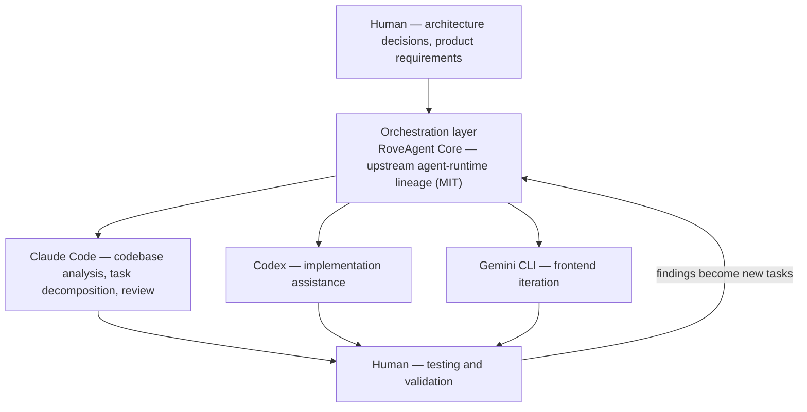

<div align="center">


# RoveFrame AI Business OS

**Sistema operativo de negocio nativo de IA, impulsado por flujos de trabajo multiagente.**

Los agentes hacen el trabajo. Las personas conservan la autoridad.

[English](README.md) · [简体中文](README.zh-CN.md) · **Español**

[](https://github.com/houjinlong258-oss/roveframe/actions/workflows/ci.yml)
[](LICENSE)


</div>

---

## Visión general

RoveFrame es un **sistema operativo de negocio con IA** para pequeñas empresas. No es un chatbot
envuelto alrededor de un panel: es una plataforma de ejecución donde los agentes LLM observan datos
reales del negocio, proponen acciones concretas y —solo después de que una persona las aprueba—
ejecutan esas acciones contra sistemas reales, dejando una traza de auditoría detrás.

La primera vertical es un restaurante: pedidos, menús, clientes, personal, reparto, reservas,
marketing y correo, todo en una sola superficie operativa. La arquitectura de fondo es agnóstica de
la vertical: las reglas de negocio viven en capas de configuración y de prompts, no en ramas
codificadas a mano.

RoveFrame es el producto y la **capa de control**; **RoveAgent Core** es el plano de inteligencia y
ejecución. Son procesos separados, con un contrato estrecho y autenticado entre ambos.

**El problema de diseño que resuelve este proyecto** es el que separa una demo de un sistema: un LLM
que puede *actuar* es un pasivo, a menos que puedas responder cuatro preguntas sobre cada acción que
ejecuta.

| Pregunta | Cómo la responde este sistema |
|---|---|
| ¿Quién tiene permitido hacer esto? | Matriz de roles y permisos más espacios de nombres de herramientas por agente, resueltos en el servidor, con denegación por defecto |
| ¿Hubo validación humana? | Objetos de aprobación con **argumentos congelados**, restringidos al propietario y con estado de ejecución visible |
| ¿Qué pasó realmente? | Filas de auditoría durables escritas *antes* de la ejecución y después del resultado: una escritura de auditoría fallida hace fallar la operación |
| ¿Cómo sabemos que funciona? | Una suite de pruebas contra la base de datos real, una verificación previa de deriva de esquema y reglas de alerta validadas por máquina (ver [Prácticas de ingeniería](#prácticas-de-ingeniería)) |

<div align="center">

</div>

---

## Funcionalidades clave

**Orquestación multiagente.** Cada rol de agente con nombre (CEO, Operations, Marketing, Customer,
Developer, DevOps) recibe un espacio de nombres de herramientas y un nivel de capacidad explícitos.
Un rol solo puede alcanzar las herramientas que se le otorgaron, y esa compuerta se aplica en
código, no pidiéndoselo amablemente al modelo en un prompt.

**Motor de flujos de trabajo de agentes.** Una cola de tareas durable con tomas atómicas
(`FOR UPDATE SKIP LOCKED`), recuperación de leases para workers que se cayeron, presupuestos de
reintentos y planificación por tick. El trabajo de larga duración no vive dentro de una petición
HTTP.

**Registro de herramientas.** Las herramientas se declaran con un esquema de entrada, un permiso
requerido y un nivel de riesgo; después se invocan a través de un único runtime que aplica las
compuertas en un orden fijo —**permiso → auditoría → ejecución**— con un timeout y un registro del
resultado.

**Control de permisos.** Una matriz de roles y permisos resuelta desde la base de datos, más una
segunda verificación de espacio de nombres por rol de agente. Las peticiones llevan contexto
verificado de tenant y de negocio, y cada acceso a datos queda acotado por él. Los argumentos que
aporta el modelo nunca pueden elegir ese alcance.

**Flujo de aprobación.** Las acciones sensibles (reembolsos, envíos masivos, despliegues) crean una
aprobación en lugar de ejecutarse. Los argumentos se congelan en el momento de la petición, así que
lo aprobado es exactamente lo que se ejecuta. Las aprobaciones están restringidas al propietario,
caducan y son auditables.

**Validación humana en el circuito.** Los agentes presentan *propuestas*, no hechos consumados: el
operador ve la recomendación, el razonamiento y el payload exacto antes de que se ejecute cualquier
cosa irreversible.

**Registro de auditoría.** Toda mutación privilegiada escribe un registro durable de intención antes
de la ejecución y un registro del resultado después. Si el almacén de auditoría no está disponible,
la operación falla cerrado en lugar de continuar sin registro.

**Integración de LLM.** Una capa de enrutamiento agnóstica del proveedor, con asignación de modelo
por capacidad (`agent` / `content` / `rag` / `light`), failover entre proveedores y un respaldo de
plataforma para que el producto siga funcionando antes de que un cliente conecte su propia clave.
Las credenciales se cifran en reposo con AES-256-GCM.

**Automatización de flujos de trabajo.** Un planificador impulsa el trabajo recurrente: resúmenes
ejecutivos diarios, alertas de anomalías, sincronización de correo entrante, colas de envío
saliente, entrega de web push, purgas de retención de posiciones de reparto y sondeo de la cola de
tareas.

**Multi-tenant por construcción.** El alcance de tenant y de negocio no es una convención: lo
inyecta la frontera de red, se vuelve a verificar en el handler, lo aplican otra vez los helpers de
acceso a datos y, por último, lo respalda la seguridad a nivel de fila de Postgres.

**Superficie de producto trilingüe.** Inglés, chino y español, con una prueba de paridad de claves
que hace fallar el build cuando una traducción se desvía.

---

## Superficie de producto

Cuatro vistas del producto, desde el centro de mando del propietario hasta el conjunto de módulos.
Cada panel se muestra a ancho completo para que el detalle sea legible; todos corresponden a una
ruta real de este repositorio.

> **Qué son estas imágenes.** Gráficos de visión general del producto, renderizados a partir de las
> propias pantallas de la aplicación, no capturas de un despliegue en vivo. La plataforma todavía no
> tiene un origen público (`app.roveframe.ai` en el marco de la maqueta es un marcador de posición de
> diseño), y los paneles muestran un espacio de trabajo vacío a propósito, de modo que nunca se
> representa ningún dato de cliente. Las capturas reales y sin editar van en `docs/screenshots/`,
> que sigue vacía y explica por qué: consulta [esa nota](docs/screenshots/README.md).

### Centro de mando y el AI COO


El resumen matutino del propietario: lo que el equipo de IA hizo durante la noche, ingresos /
pedidos / clientes / conversión —con un estado honesto de `no comparative data` en lugar de un delta
inventado— y la plantilla de agentes (CEO, Operations, Marketing, Customer) con la actividad de cada
uno. A su lado, el asistente AI COO redacta y razona sobre los mismos datos.
→ `src/app/[locale]/dashboard`, `agent`

### Módulos de operación


La superficie operativa diaria: datos del negocio (productos, pedidos, inventario), reservas con un
calendario de estados en vivo, gestión de equipo con roles, control de acceso y el centro de personal
(beneficios, excepciones de asistencia, tareas de cuidado), y el constructor de sitios web con IA
para una tienda pública con dominio personalizado y pedidos en línea. → `business`, `reservations`,
`team`, `website`

### Integraciones y la capa de control


Un solo lugar para conectar el mundo exterior y acotar lo que los agentes pueden hacer: proveedor de
mapas de reparto, credenciales de servicios de terceros, acceso a modelos de IA (enrutamiento por
capacidad), conectividad con ERPNext, conectores de POS y de pagos, junto con la configuración de
buzones salientes y entrantes, la tasa de envío y los límites diarios, y los interruptores de
respuesta automática al cliente, push de anomalías y resumen diario.
→ `settings`

### Contenido e inteligencia de clientes


Las superficies de conocimiento y comunicación: un centro de archivos para subidas e informes
generados por IA, un cerebro de conocimiento que responde a partir de tus propios SOP y políticas con
citas, inteligencia de reseñas con análisis de sentimiento y redacción de respuestas, y un centro de
correo que clasifica el correo entrante en consulta / oportunidad / queja / proveedor / otro.
→ `files`, `knowledge`, `reviews`, `emails`

---

## Arquitectura del sistema

El sistema son dos planos con un solo contrato.

```
Human User
    ↓  natural language · files · project context
Application Layer            Next.js 16 (App Router, React 19, TypeScript strict)
    ↓  task request
Agent Orchestration Layer    RoveAgent Core — FastAPI runtime, capability registry & router
    ↓  assign & coordinate
Specialized Agents           CEO · Operations · Marketing · Customer · Developer · DevOps
    ↓  use tools & data
Tools / APIs / Data Layer    internal tools · connectors · knowledge base · web search · Postgres
    ↓  results & evidence
Human Validation             review · approve · request changes · continue iteration
    ↺  feedback loop  →  audit & memory  →  better next time
```

**Capa de control** (`src/`) — la superficie de producto, el modelo de tenant e identidad, el sistema
de aprobaciones y auditoría, y toda la capa de acceso a datos. Cada punto de entrada HTTP pasa por
una única frontera de red que autentica la sesión, elimina las cabeceras de contexto falsificadas por
el cliente e inyecta `tenant_id` / `business_id` / `role` verificados para los handlers posteriores.

**Plano de ejecución** (`roveagent/`) — el runtime de Python que es dueño del bucle del agente, el
descubrimiento de capacidades, el failover entre proveedores, la ejecución de herramientas y el
streaming. Es un proceso aparte en un puerto solo interno; la capa web se comunica con él mediante
una clave compartida más callbacks firmados con HMAC.

La frontera entre ambos es deliberadamente estrecha: la capa web nunca ejecuta por sí misma acciones
dirigidas por el modelo, y el runtime no tiene acceso de escritura privilegiado a las tablas de
negocio.

### Flujo de datos de una acción de agente

```
1. Request      → proxy authenticates, strips forged headers, injects verified scope
2. Handler      → central mutation guard: entitlement → tenant scope → permission
3. Intent       → durable audit row written BEFORE execution (failure ⇒ 503, fail closed)
4. Agent        → runtime resolves capability → tool registry → schema validation
5. Approval     → if the action is sensitive: frozen-argument approval, owner-gated
6. Execution    → tool runs under a timeout; result recorded
7. Outcome      → audit row written AFTER execution (failure ⇒ reported, never silent)
8. Evidence     → UI shows status; metrics expose counters; alert rules watch the backlog
```

---

## Flujo de trabajo de desarrollo con agentes

Este repositorio es en sí mismo un ejemplo de ingeniería nativa de IA: las personas son dueñas de la
arquitectura y el criterio; los agentes, de la amplitud y la velocidad de iteración.



| Etapa | Quién | De qué es responsable |
|---|---|---|
| Dirección | Persona | Arquitectura, modelo de datos, fronteras de seguridad, requisitos de producto |
| Orquestación | Runtime multiagente | Enrutar el trabajo, sostener el contexto, coordinar agentes especializados |
| Análisis | Claude Code | Leer el código, descomponer tareas, revisión adversarial del resultado |
| Implementación | Codex | Implementación acotada contra un contrato definido |
| Iteración de frontend | Gemini CLI | Construcción de UI e iteración visual |
| Verificación | Persona | Ejecutar las compuertas, juzgar la evidencia, aceptar o rechazar el resultado |

La regla no negociable de este ciclo: **la afirmación de un agente no es evidencia hasta que un
comando la demuestra.** Toda guarda de este repositorio debe fallar cuando aquello que protege está
roto: una verificación que no puede fallar se trata como un defecto, no como cobertura.

---

## Stack técnico

**Frontend**

| Tecnología | Rol |
|---|---|
| Next.js 16 (App Router) | Enrutamiento, componentes de servidor, manejadores de ruta, entrada de servidor personalizada |
| React 19 | UI |
| TypeScript 5 (strict) | Tipado de toda la aplicación, sin `any` implícito |
| Tailwind CSS 4 + shadcn/ui (Radix) | Sistema de diseño, 50+ primitivas de UI |
| next-intl | en / zh / es con aplicación de paridad de claves |
| Serwist | Service worker de PWA (por ahora deshabilitado en Turbopack; ver `next.config.ts`) |
| Recharts · react-markdown | Gráficos del panel, salida del agente en streaming |

**Backend**

| Tecnología | Rol |
|---|---|
| Manejadores de ruta de Next.js | 132 en total |
| Servidor personalizado de Node (`src/server.ts`) | Planificador, verificación previa de arranque, migración automática, guardas a nivel de proceso |
| Python 3.11–3.13 · FastAPI · uvicorn | Plano de ejecución de RoveAgent Core |
| Primitivas TypeScript del runtime de agentes | Presupuesto de iteraciones, guarda de repetición, canonicalización de llamadas a herramientas |
| zod | Esquema de cada cuerpo de petición y de cada entrada de herramienta |

**Datos**

| Tecnología | Rol |
|---|---|
| Postgres de Supabase | 52 tablas, única fuente de verdad |
| Seguridad a nivel de fila | Habilitada en todas las tablas públicas, cada una con políticas explícitas |
| PostgREST · GoTrue · Storage | Acceso a datos, identidad, medios |
| `service_role` del lado del servidor | Acceso privilegiado, nunca expuesto al navegador |
| AES-256-GCM (`src/lib/crypto.ts`) | Cifrado en reposo de credenciales de proveedores, buzones e integraciones |

**IA / LLM**

| Tecnología | Rol |
|---|---|
| Router agnóstico del proveedor | Capacidades `agent` / `content` / `rag` / `light`, asignación de modelo por capacidad |
| 10 presets de proveedor | Anthropic, OpenAI, Gemini, DeepSeek, Doubao, Kimi, Qwen, GLM, Grok, más un endpoint personalizado compatible con OpenAI |
| Cadena de failover | Política de degradación explícita en lugar de un reintento silencioso |
| Embeddings + pgvector | Recuperación de 1024 dimensiones para la base de conocimiento |
| Bucle de uso de herramientas | Permiso → auditoría → ejecución, con timeouts |

**Infraestructura**

| Tecnología | Rol |
|---|---|
| Docker Compose | Dos servicios: `web` (:5000, público) y `roveagent` (:8788, solo interno) |
| Dockerfiles | Imágenes separadas por plano; sin secretos incrustados |
| Caddy | TLS y certificados bajo demanda para los sitios de los comercios |
| Endpoint de texto de Prometheus | `/api/metrics` más 13 reglas de alerta con un validador automático |
| GitHub Actions | 3 jobs de CI: compuerta de TypeScript, instalación de Python en Linux + suite, y ambos builds de contenedor |

---

## Estructura del proyecto

```
src/
  app/
    [locale]/            24 route groups — dashboard, agent, approvals, audit, knowledge,
                         reviews, customers, marketing, emails, business, reservations,
                         settings, team, staff, enterprise, files, store, site, website,
                         onboarding, admin, auth, unsubscribe, (marketing)
    api/                 132 route handlers
  components/            feature-grouped UI (agent, customer, delivery, layout, owner,
                         settings, staff, site, pwa, workspace, ui)
  lib/
    agent/               approvals, missions, registry, audit, personas
    enterprise/          agent roles, tool runtime, memory layers
    ai/  security/  payments/  email/  notifications/  observability/  connectors/
    tenant-db.ts         scoped data-access helpers
    mutation-guard.ts    central authenticate → scope → permission → intent → execute gate
  proxy.ts               network boundary: session check, header sanitisation, request id
roveagent/               RoveAgent Core — Python execution plane
  api/                   FastAPI app, capability registry/providers/router, plugin security
  tools/  skills/  plugins/  workforce/  tenant/  connectors/  gateway/
packages/roveagent-core/ TypeScript agent-loop primitives + third-party attribution manifest
scripts/                 migrations, validation gates, operational tooling
tests/                   118 TypeScript test files
docs/                    architecture, operations, engineering audit reports, assets
ops/alerts/              Prometheus alert rules
docker/                  deploy env templates, Caddy, database helpers
messages/                English, Chinese and Spanish product messages
```

---

## Desarrollo

### Requisitos previos

| Herramienta | Versión |
|---|---|
| Node.js | 22 |
| pnpm | 9 o superior (npm y yarn son rechazados por una guarda de `preinstall`) |
| Python | 3.11 – 3.13 |
| Docker | Opcional, para la ruta de contenedores |

### Instalación

```bash
git clone https://github.com/houjinlong258-oss/roveframe.git
cd roveframe

pnpm install --frozen-lockfile           # web tier
pip install -e "./roveagent[web]"        # execution plane, with the FastAPI extras
```

### Configuración del entorno

Todas las credenciales se proporcionan en tiempo de ejecución; nada se incrusta en una imagen y nada
se sube al repositorio. Nunca hagas commit de archivos de entorno locales ni de valores de
credenciales.

```bash
cp .env.example .env                             # web tier
cp docker/deploy.env.example docker/deploy.env   # container path
```

Las variables que más importan:

| Variable | Propósito |
|---|---|
| `COZE_SUPABASE_URL` / `_ANON_KEY` / `_SERVICE_ROLE_KEY` | Endpoint y claves del proyecto. La clave service-role es **solo del lado del servidor**. |
| `COZE_SUPABASE_JWT_SECRET` | Habilita la verificación local de JWT y elimina un viaje de ida y vuelta en cada petición. |
| `ENCRYPTION_SECRET` | Clave AES-256-GCM para las credenciales guardadas en la base de datos (32+ caracteres). La rotación se admite mediante `ENCRYPTION_SECRET_PREVIOUS`. |
| `ROVEAGENT_API_KEY` / `ROVEAGENT_APPROVAL_SECRET` | Autenticación entre servicios. El runtime **se niega a arrancar** si estas dos son iguales; de lo contrario, tener la clave del llamador también significaría poder firmar callbacks de aprobación. |
| `ROVEAGENT_LLM_API_KEY` | Clave del proveedor para el runtime de agentes. |

### Ejecución local

```bash
pnpm dev                # development server (port from .preview, default 5000)

python scripts/run-python-tests.py     # execution-plane suite (offline, no provider spend)
pnpm validate                          # the full gate
```

`pnpm validate` ejecuta el contrato de migraciones, TypeScript, lint (código y estilos), la suite de
pruebas completa y el escaneo de producción. Un cambio no está terminado hasta que sale con 0.

Las compuertas focalizadas también están disponibles por separado:

```bash
pnpm scan:secrets   # credential scan — reports locations only, never values
pnpm scan:brand     # placeholder-brand leakage
pnpm scan:globals   # accidental globals
pnpm scan:artifacts # stray build artifacts
pnpm build          # production build (Next.js + custom server bundle)
```

Ruta de contenedores:

```bash
docker compose --env-file docker/deploy.env up -d --build
curl -fsS http://localhost:5000/api/health
```

### Base de datos

Los cambios de base de datos son aditivos y viven en `scripts/migrate.sql` más archivos de migración
focalizados bajo `scripts/`. Revisa el proyecto destino antes de aplicar nada:

```bash
npx tsx scripts/run-migrate.ts
```

No apliques migraciones contra un destino de base de datos no identificado o no verificado.

### Entrega del código fuente

Los archivos de código fuente se generan a partir de una allowlist explícita y se escriben fuera del
repositorio. El empaquetador ejecuta el escaneo de producción antes de escribir:

```bash
pnpm package:source -- --output ../roveframe-ai-business-os-source.zip
```

---

## Despliegue

**Dos rutas admitidas. Elige una; no las mezcles.** La diferencia está en dónde vive la base de
datos.

| | Ruta A — base de datos integrada | Ruta B — Supabase externo |
|---|---|---|
| Comando | `bash install.sh` | `docker compose --env-file docker/deploy.env up -d --build` |
| Base de datos | Postgres 17 en un contenedor, más PostgREST, GoTrue y Storage | tu propio proyecto de Supabase |
| Credenciales | se generan para ti en `docker/deploy.env` (modo 600) | tú rellenas cada valor marcado como REQUIRED |
| Ideal para | un servidor desde cero, autoalojamiento, sin registros | un proyecto de Supabase existente, con backups gestionados |
| Archivos Compose | `docker-compose.yml` + `docker-compose.selfhosted.yml` | `docker-compose.yml` |

### Ruta A — un solo comando en un servidor desde cero

```bash
git clone https://github.com/houjinlong258-oss/roveframe.git
cd roveframe
bash install.sh --domain app.example.com --email ops@example.com --llm-key sk-...
```

`install.sh` levanta toda la plataforma detrás de Caddy con HTTPS automático:

| Contenedor | Rol |
|---|---|
| `db` | `supabase/postgres:17.6.1.136` — la base de datos, en un volumen con nombre |
| `rest` | PostgREST `v14.17` — la API de datos con la que habla la aplicación |
| `auth` | GoTrue `v2.196.0` — identidad (se ejecuta con autoconfirm, así que no hace falta un relay de correo) |
| `storage` | Storage API `v1.74.0` — imágenes y videos de productos |
| `gateway` | nginx `1.27-alpine` — expone **solo** `/storage/v1/object/public/*`; PostgREST y GoTrue no son alcanzables desde internet |
| `edge` | Caddy `2-alpine` — TLS, certificados bajo demanda para dominios personalizados de comercios |
| `web` | la capa de control de Next.js (ligada a `127.0.0.1:5000`; todo lo público pasa por `edge`) |

Flags útiles: `--registry docker.m.daocloud.io/` cuando Docker Hub está bloqueado, `--admin-email` /
`--admin-password` / `--business "My Shop"` para crear la primera cuenta de propietario, `--yes` para
instalaciones desatendidas.

Es **idempotente** —volver a ejecutarlo conserva el `docker/deploy.env` existente, así que no rota el
secreto JWT por debajo de los usuarios que ya tienen sesión iniciada ni cambia la contraseña de la
base de datos una vez inicializado el volumen— y **falla en voz alta**: cada espera tiene un plazo
límite e imprime los logs del contenedor al agotarse.

Deliberadamente **no** toca el DNS (apunta primero un registro A/AAAA al servidor, o instala sin
`--domain` y usa `http://<server-ip>`), y no configura ningún relay de correo.

### Ruta B — Supabase externo

```bash
cp docker/deploy.env.example docker/deploy.env
# fill in every value marked REQUIRED, then:
docker compose --env-file docker/deploy.env up -d --build
```

### Qué exige producción

Tres de estas hacen que la aplicación **se niegue a arrancar** en lugar de correr a medio configurar:

| Variable | Notas |
|---|---|
| `COZE_SUPABASE_URL` / `_ANON_KEY` | Endpoint del proyecto y clave pública |
| `COZE_SUPABASE_SERVICE_ROLE_KEY` | **Obligatoria en producción**: el servicio web se niega a arrancar sin ella. Solo del lado del servidor, nunca se envía a un navegador |
| `COZE_SUPABASE_JWT_SECRET` | Recomendada: verifica las sesiones en local en vez de hacer un viaje de ida y vuelta por petición |
| `ENCRYPTION_SECRET` | **Obligatoria en producción.** Clave AES-256-GCM para las credenciales almacenadas, 32+ caracteres. Debe **ser distinta** de la clave service-role: reutilizarla significa que rotar la credencial de la base de datos vuelve indescifrable para siempre cada secreto almacenado. Rota mediante `ENCRYPTION_SECRET_PREVIOUS` (solo descifrado) |
| `ROVEAGENT_API_KEY` / `ROVEAGENT_APPROVAL_SECRET` | Autenticación entre servicios. Deben ser valores **distintos**: el runtime responde 503 cuando coinciden, para que tener la clave del llamador no confiera además autoridad para firmar aprobaciones |
| `ROVEAGENT_LLM_API_KEY` | El runtime de agentes responde 503 sin ella en lugar de fabricar una respuesta |
| `NEXT_PUBLIC_APP_URL` | Origen público: se lee en tiempo de ejecución, no se incrusta en la imagen |
| `SITE_DOMAIN` | Vacío significa una instalación solo por IP |
| Modelo de plataforma (`ROVEFRAME_PLATFORM_LLM_*`) | Opcional, pero conviene definirlo en instalaciones autoalojadas: sin un modelo de plataforma, un tenant **recién registrado** cuyo `model_assign` sea `auto` no tiene ningún modelo que funcione, porque el registro crea tenant, negocio, usuario y perfil, pero ninguna fila en `settings` |

### Salud, preparación y métricas

La imagen incluye su propia sonda de preparación, así que un orquestador no necesita cableado
adicional:

```
HEALTHCHECK --interval=30s --timeout=20s --start-period=90s --retries=3
  → fetch http://127.0.0.1:5000/api/health     (non-2xx ⇒ unhealthy)
```

`/api/health` devuelve **503** a menos que se cumplan las tres condiciones: el esquema en vivo
coincide con las 52 tablas / 600+ columnas esperadas, el runtime de agentes responde y el latido del
planificador es reciente. Es decir, «contenedor arriba, base de datos desviada» es exactamente el
estado que deja de recibir tráfico.

```bash
curl -fsS http://localhost:5000/api/health            # 200 when ready, 503 with reasons when not
curl -fsS -H "X-RoveAgent-Key: $ROVEAGENT_API_KEY" \
     http://localhost:5000/api/metrics                # Prometheus text format
```

`ops/alerts/roveframe.rules.yml` contiene 13 reglas de alerta listas para cargar (disponibilidad,
planificador, acumulación en la cola, pagos, memoria) con un validador sin dependencias:

```bash
node scripts/check-alert-rules.mjs --base http://localhost:5000 --key "$ROVEAGENT_API_KEY"
```

### Creación y migración del esquema en el primer arranque

`autoMigrate()` aplica los **20** archivos de migración (idempotentes: `create … if not exists`,
`add column if not exists`, `drop policy if exists` + `create policy`) y después la verificación
previa comprueba el resultado. Solo se ejecuta desde el punto de entrada de producción: `next start`
**no** carga `src/server.ts`, así que no migrará nada.

La migración necesita **una** de `DATABASE_URL` / `POSTGRES_URL` / `DIRECT_URL` /
`COZE_SUPABASE_DATABASE_URL` / `SUPABASE_DATABASE_URL` / `PG_CONNECTION_STRING`, o bien
`SUPABASE_ACCESS_TOKEN`. Sin ellas, el proceso igual arranca y lo registra con claridad:

```
⚠️ [migrate] 未配置 DATABASE_URL 或 SUPABASE_ACCESS_TOKEN，跳过自动建表。
✓ [boot-check] 数据库 schema 完整
```

Ese es el modo de falla seguro: negarse a adivinar, decir qué falta y dejar que `/api/health` reporte
la consecuencia.

### Dominios personalizados (tiendas de comercios)

Un comercio vincula su propio dominio en la aplicación; Caddy emite el certificado bajo demanda y
consulta primero a la aplicación, para que el servidor nunca pueda usarse para emitir certificados de
nombres de host arbitrarios:

```caddyfile
on_demand_tls { ask http://web:5000/api/site/authorize }
```

Ese endpoint responde **200** solo cuando el host coincide con `SITE_DOMAIN`, o con una fila de
`public_sites` cuyo `custom_domain` esté activo *y* habilitado; cualquier otro caso es 404, falla
cerrado. Una prueba de cableado verifica que esta ruta `ask` tenga de verdad un handler registrado y
figure en la allowlist pública, porque un error de tipeo aquí falla en silencio: Caddy trata cualquier
respuesta no-2xx como denegación, así que ningún dominio de comercio obtendría nunca un certificado.

### Restricción de escalado: ejecuta una sola réplica

El rate limiting y los cupos de concurrencia del chat viven en la memoria del proceso, así que la
build actual es **de réplica única por definición**. Definir `ROVEFRAME_RATE_LIMIT_SHARED=1` es una
*declaración* de que existe un backend compartido, no un interruptor: la verificación del contrato de
arranque falla en voz alta si está definida y el backend no existe. Del mismo modo, ejecuta
exactamente un proceso dueño del planificador; un segundo duplicaría los ticks.

### Lista de verificación posterior al despliegue

1. `curl -fsS http://<host>/api/health` → 200 (503 significa deriva de esquema o un runtime
   inalcanzable; la respuesta dice cuál).
2. Inicia sesión con la cuenta de propietario creada por `install.sh --admin-email`, o crea o
   restablece una con `npx tsx scripts/ensure-initial-user.ts` (idempotente; restablece la contraseña
   si la cuenta existe).
3. `curl -H "X-RoveAgent-Key: …" /api/metrics` → contadores presentes, y
   `roveframe_metrics_collection_ok` vale 1 para cada colector.
4. Haz scrape de `/api/metrics` y carga `ops/alerts/roveframe.rules.yml`: sin esto, un planificador
   atascado o una cola que crece son invisibles.
5. Rota cualquier credencial que se haya generado o compartido durante la instalación y vuelve a
   comprobar la salud.

---

## Prácticas de ingeniería

Esta es la parte del proyecto por la que más vale la pena leer el código. El repositorio trata la
**verificación como una funcionalidad de primera clase**, y varias guardas existen específicamente
porque una versión anterior de este proyecto publicó un defecto que ninguna prueba podía ver.

| Práctica | Qué significa aquí |
|---|---|
| Falla cerrado por defecto | Si el almacén de auditoría no responde, la mutación falla. Si una verificación de esquema no puede leer la base de datos, informa *failed*, no *healthy*. |
| Las guardas deben poder fallar | Cada guarda se valida revirtiendo la corrección y confirmando que la guarda se pone en rojo. Una verificación cuya falla no puede producirse se reporta como que no demuestra nada. |
| Invariantes contra la base de datos real | La cobertura de seguridad a nivel de fila se verifica contra la base de datos real —tanto «todas las tablas tienen RLS» como «ninguna tabla tiene RLS con cero políticas»—, no contra el texto de las migraciones. |
| Detección de deriva de esquema | La verificación previa de arranque deriva su expectativa de la definición del esquema y la compara con la base de datos en vivo (52 tablas / 600+ columnas), en lugar de mantener un subconjunto escrito a mano. |
| Reglas de alerta que referencian métricas reales | Un validador sin dependencias rechaza cualquier regla que nombre una métrica que el código no exporta, y la contrasta con el endpoint de métricas en vivo. |
| Rutas de dinero probadas por comportamiento | Los exponentes de moneda (monedas con cero, dos y tres decimales), la verificación de firmas con un control positivo explícito y la idempotencia se comprueban ejecutando el código. |
| Documentación honesta | Los informes de auditoría declaran lo que *no* está terminado. Cuando una prueba necesita credenciales que no están presentes, se informa como `UNVERIFIED` en lugar de pasar en silencio. |

Estado de las compuertas en el checkout actual: **1,461 pruebas de TypeScript** (0 fallos), **815
pruebas de Python** (0 fallos), y el escaneo de producción está limpio en todo el árbol (2,500+
archivos).

---

## Estado del proyecto

**Pre-lanzamiento.** Es un sistema que funciona, construido y operado de punta a punta, no un
prototipo. También es honesto sobre sus bordes:

- **Implementado y ejercitado contra una base de datos real**: multi-tenancy, RBAC, flujos de
  aprobación y auditoría, el runtime de agentes, el planificador, flujos de reparto y de personal,
  correo y push.
- **Deliberadamente manual por ahora**: la facturación de comercios. Las suscripciones las aprovisiona
  un operador con registros de pago fuera de línea. La facturación recurrente automatizada es una
  decisión de producto que todavía no se tomó.
- **Aún no verificado en este entorno**: el comportamiento en dispositivos iOS/Safari reales, los
  ciclos completos contra proveedores de pago en vivo (no hay credenciales de comercios) y la
  capacidad de publicación en redes sociales (implementada y probada, pero todavía no conectada al
  registro de herramientas).

En este proyecto no aparecen cifras de usuarios, ni datos de ingresos, ni nombres de clientes, porque
no hay ninguno que reportar.

---

## Hoja de ruta futura

Direcciones posibles, en orden aproximado de prioridad. Nada de esto se declara como ya construido.

- **Más capacidades de agente**: ampliar el registro de herramientas y conectar la superficie de
  publicación en redes sociales, que está implementada pero sin cablear.
- **Mejor automatización de flujos de trabajo**: mover a la cola de tareas durable el trabajo que aún
  ocurre en tiempo de petición; primitivas de planificación más ricas.
- **Más integraciones**: completar el adaptador de ERP más allá de la conectividad; añadir más
  conectores de POS y de pagos detrás del contrato de webhook existente.
- **Escalado horizontal**: reemplazar el estado en proceso de rate limiting y concurrencia por un
  backend compartido. El contrato de despliegue para esto ya se verifica en el arranque.
- **Operaciones**: agregación de logs y tracing; la parte de métricas y alertas ya existe.

---

## Licencia

MIT: consulta [LICENSE](LICENSE).

`roveagent/` deriva de un runtime de agentes upstream publicado bajo la licencia MIT
(Copyright © 2025 Nous Research). El texto original de la licencia y el manifiesto completo de
atribución —que nombran explícitamente al proyecto upstream— se conservan en
[`roveagent/NOTICE`](roveagent/NOTICE), [`roveagent/LICENSE`](roveagent/LICENSE) y
[`packages/roveagent-core/THIRD_PARTY_NOTICES.md`](packages/roveagent-core/THIRD_PARTY_NOTICES.md).
El texto de licencias y atribuciones de terceros se conserva **solo** en esas ubicaciones designadas,
que el escaneo de marca del repositorio exime por diseño; por eso este README apunta a ellas en lugar
de repetir la atribución aquí.

La capa empresarial —multi-tenancy, RBAC, aprobaciones, auditoría, conectores y la superficie de
producto— es trabajo original de este repositorio.

<div align="center">
<sub>Construido con agentes. En manos humanas.</sub>
</div>
