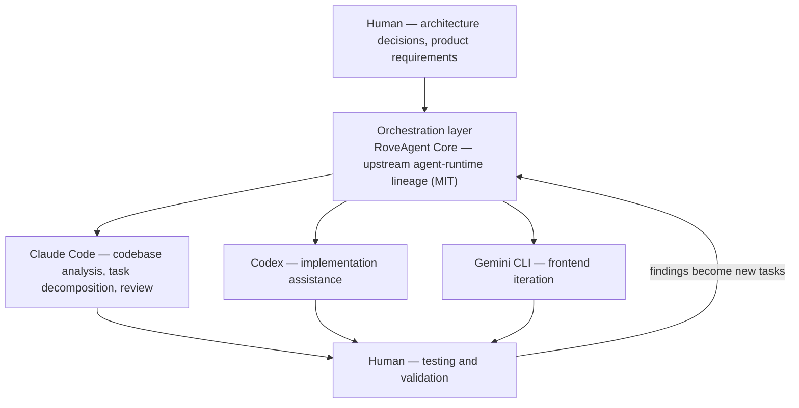

<div align="center">


# RoveFrame AI Business OS

**AI-native business operating system powered by multi-agent workflows.**

Agents do the work. Humans keep the authority.

[](https://github.com/houjinlong258-oss/roveframe/actions/workflows/ci.yml)
[](LICENSE)


</div>

---

## Overview

RoveFrame is an **AI business operating system** for small businesses. It is not a chatbot
wrapped around a dashboard: it is an execution platform where LLM agents observe real
business data, propose concrete actions, and — only after a human approves them — execute
those actions against real systems, leaving an audit trail behind.

The first vertical is a restaurant: orders, menus, customers, staff, delivery, reservations,
marketing and email, all in one operational surface. The architecture underneath is
vertical-agnostic — business rules live in configuration and prompt layers, not in hard-coded
branches.

RoveFrame is the product and **control plane**; **RoveAgent Core** is the intelligence and
execution plane. They are separate processes with a narrow, authenticated contract between them.

**The design problem this project solves** is the one that separates a demo from a system: an
LLM that can *act* is a liability unless you can answer four questions about every action it
takes.

| Question | How this system answers it |
|---|---|
| Who is allowed to do this? | Role/permission matrix plus per-agent tool namespaces, resolved server-side, deny by default |
| Was a human in the loop? | Approval objects with **frozen arguments**, owner-gated, with visible execution status |
| What actually happened? | Durable audit rows written *before* execution and after the outcome — a failed audit write fails the operation |
| How do we know it works? | A live-database test suite, a schema-drift preflight, and machine-validated alert rules (see [Engineering practices](#engineering-practices)) |

<div align="center">

</div>

---

## Key Features

**Multi-agent orchestration.** Named agent roles (CEO, Operations, Marketing, Customer,
Developer, DevOps) each receive an explicit tool namespace and capability tier. A role can only
reach the tools it was granted, and that gate is enforced in code — not by asking the model
politely in a prompt.

**Agent workflow engine.** A durable task queue with atomic claims (`FOR UPDATE SKIP LOCKED`),
lease recovery for crashed workers, retry budgets, and per-tick scheduling. Long-running work
does not live inside an HTTP request.

**Tool registry.** Tools are declared with an input schema, a required permission and a risk
level, then invoked through a single runtime that applies the gates in a fixed order —
**permission → audit → execution** — with a timeout and an outcome record.

**Permission control.** A role/permission matrix resolved from the database, plus a second
namespace check per agent role. Requests carry verified tenant and business context, and every
data access is scoped by it. Model-supplied arguments can never choose that scope.

**Approval workflow.** Sensitive actions (refunds, bulk sends, deployments) create an approval
instead of executing. Arguments are frozen at request time, so the thing approved is exactly the
thing executed. Approvals are owner-gated, expire, and are auditable.

**Human-in-the-loop validation.** Agents surface *proposals*, not *fait accompli*: an operator
sees the recommendation, the reasoning and the exact payload before anything irreversible runs.

**Audit logging.** Every privileged mutation writes a durable intent record before execution and
an outcome record afterwards. If the audit store is unavailable, the operation fails closed
rather than proceeding unrecorded.

**LLM integration.** A provider-agnostic routing layer with per-capability model assignment
(`agent` / `content` / `rag` / `light`), failover across providers, and a platform fallback so
the product still works before a customer connects their own key. Credentials are encrypted at
rest with AES-256-GCM.

**Workflow automation.** A scheduler drives recurring work: daily executive briefs, anomaly
alerts, inbound email sync, outbound send queues, web-push delivery, delivery-position retention
purges, and task-queue polling.

**Multi-tenant by construction.** Tenant and business scope is not a convention: it is injected
by the network boundary, re-checked in the handler, enforced again by the data-access helpers,
and finally backstopped by Postgres row-level security.

**Trilingual product surface.** English, Chinese and Spanish, with a key-parity test that fails
the build when a translation drifts.

---

## System Architecture

The system is two planes with one contract.

```
Human User
    ↓  natural language · files · project context
Application Layer            Next.js 16 (App Router, React 19, TypeScript strict)
    ↓  task request
Agent Orchestration Layer    RoveAgent Core — FastAPI runtime, capability registry & router
    ↓  assign & coordinate
Specialized Agents           CEO · Operations · Marketing · Customer · Developer · DevOps
    ↓  use tools & data
Tools / APIs / Data Layer    internal tools · connectors · knowledge base · web search · Postgres
    ↓  results & evidence
Human Validation             review · approve · request changes · continue iteration
    ↺  feedback loop  →  audit & memory  →  better next time
```

**Control plane** (`src/`) — the product surface, the tenant and identity model, the approval and
audit system, and the entire data-access layer. Every HTTP entry point passes through a single
network boundary that authenticates the session, strips client-forged context headers, and
injects verified `tenant_id` / `business_id` / `role` for downstream handlers.

**Execution plane** (`roveagent/`) — the Python runtime that owns the agent loop, capability
discovery, provider failover, tool execution and streaming. It is a separate process on an
internal-only port; the web tier talks to it with a shared key plus HMAC-signed callbacks.

The boundary between them is deliberately narrow: the web tier never executes model-driven
actions itself, and the runtime does not hold privileged write access to business tables.

### Data flow of one agent action

```
1. Request      → proxy authenticates, strips forged headers, injects verified scope
2. Handler      → central mutation guard: entitlement → tenant scope → permission
3. Intent       → durable audit row written BEFORE execution (failure ⇒ 503, fail closed)
4. Agent        → runtime resolves capability → tool registry → schema validation
5. Approval     → if the action is sensitive: frozen-argument approval, owner-gated
6. Execution    → tool runs under a timeout; result recorded
7. Outcome      → audit row written AFTER execution (failure ⇒ reported, never silent)
8. Evidence     → UI shows status; metrics expose counters; alert rules watch the backlog
```

---

## Agent Development Workflow

This repository is itself an example of AI-native engineering: humans own architecture and
judgement, agents own breadth and iteration speed.



| Stage | Who | What they own |
|---|---|---|
| Direction | Human | Architecture, data model, security boundaries, product requirements |
| Orchestration | Multi-agent runtime | Routing work, holding context, coordinating specialised agents |
| Analysis | Claude Code | Reading the codebase, decomposing tasks, adversarial review of the result |
| Implementation | Codex | Scoped implementation against a defined contract |
| Frontend iteration | Gemini CLI | UI construction and visual iteration |
| Verification | Human | Running the gates, judging evidence, accepting or rejecting the outcome |

The non-negotiable rule in this loop: **an agent's claim is not evidence until a command proves
it.** Every guard in this repository is required to fail when the thing it guards is broken — a
check that cannot fail is treated as a defect, not as coverage.

---

## Technical Stack

**Frontend**

| Technology | Role |
|---|---|
| Next.js 16 (App Router) | Routing, server components, route handlers, custom server entry |
| React 19 | UI |
| TypeScript 5 (strict) | Whole-app type safety, no implicit `any` |
| Tailwind CSS 4 + shadcn/ui (Radix) | Design system, 50+ UI primitives |
| next-intl | en / zh / es with key-parity enforcement |
| Serwist | PWA service worker (currently disabled on Turbopack — see `next.config.ts`) |
| Recharts · react-markdown | Dashboard charts, streaming agent output |

**Backend**

| Technology | Role |
|---|---|
| Next.js route handlers | 132 API handlers |
| Node custom server (`src/server.ts`) | Scheduler, boot preflight, auto-migration, process-level guards |
| Python 3.11–3.13 · FastAPI · uvicorn | RoveAgent Core execution plane |
| TypeScript agent-runtime primitives | Iteration budget, repetition guard, tool-call canonicalisation |
| zod | Every request body and tool input schema |

**Data**

| Technology | Role |
|---|---|
| Supabase Postgres | 52 tables, single source of truth |
| Row-Level Security | Enabled on every public table, each with explicit policies |
| PostgREST · GoTrue · Storage | Data access, identity, media |
| `service_role` server-side | Privileged access, never exposed to the browser |
| AES-256-GCM (`src/lib/crypto.ts`) | Encryption of provider, mailbox and integration credentials at rest |

**AI / LLM**

| Technology | Role |
|---|---|
| Provider-agnostic router | `agent` / `content` / `rag` / `light` capabilities, per-capability model assignment |
| 10 provider presets | Anthropic, OpenAI, Gemini, DeepSeek, Doubao, Kimi, Qwen, GLM, Grok, plus a custom OpenAI-compatible endpoint |
| Failover chain | Explicit degradation policy rather than a silent retry |
| Embeddings + pgvector | 1024-dimension retrieval for the knowledge base |
| Tool-use loop | Permission → audit → execution, with timeouts |

**Infrastructure**

| Technology | Role |
|---|---|
| Docker Compose | Two services: `web` (:5000, public) and `roveagent` (:8788, internal only) |
| Dockerfiles | Separate images per plane; no baked secrets |
| Caddy | TLS and on-demand certificates for merchant sites |
| Prometheus text endpoint | `/api/metrics` plus 13 alert rules with a machine validator |
| GitHub Actions | 3 CI jobs: TypeScript gate, Linux Python install + suite, both container builds |

---

## Project Structure

```
src/
  app/
    [locale]/            24 route groups — dashboard, agent, approvals, audit, knowledge,
                         reviews, customers, marketing, emails, business, reservations,
                         settings, team, staff, enterprise, files, store, site, website,
                         onboarding, admin, auth, unsubscribe, (marketing)
    api/                 132 route handlers
  components/            feature-grouped UI (agent, customer, delivery, layout, owner,
                         settings, staff, site, pwa, workspace, ui)
  lib/
    agent/               approvals, missions, registry, audit, personas
    enterprise/          agent roles, tool runtime, memory layers
    ai/  security/  payments/  email/  notifications/  observability/  connectors/
    tenant-db.ts         scoped data-access helpers
    mutation-guard.ts    central authenticate → scope → permission → intent → execute gate
  proxy.ts               network boundary: session check, header sanitisation, request id
roveagent/               RoveAgent Core — Python execution plane
  api/                   FastAPI app, capability registry/providers/router, plugin security
  tools/  skills/  plugins/  workforce/  tenant/  connectors/  gateway/
packages/roveagent-core/ TypeScript agent-loop primitives + third-party attribution manifest
scripts/                 migrations, validation gates, operational tooling
tests/                   118 TypeScript test files
docs/                    architecture, operations, engineering audit reports, assets
ops/alerts/              Prometheus alert rules
docker/                  deploy env templates, Caddy, database helpers
messages/                English, Chinese and Spanish product messages
```

---

## Development

### Prerequisites

| Tool | Version |
|---|---|
| Node.js | 22 |
| pnpm | 9 or newer (npm and yarn are rejected by a `preinstall` guard) |
| Python | 3.11 – 3.13 |
| Docker | Optional, for the container path |

### Installation

```bash
git clone https://github.com/houjinlong258-oss/roveframe.git
cd roveframe

pnpm install --frozen-lockfile           # web tier
pip install -e "./roveagent[web]"        # execution plane, with the FastAPI extras
```

### Environment Setup

Every credential is supplied at runtime; nothing is baked into an image and nothing is
committed. Never commit local environment files or credential values.

```bash
cp .env.example .env                             # web tier
cp docker/deploy.env.example docker/deploy.env   # container path
```

The variables that matter most:

| Variable | Purpose |
|---|---|
| `COZE_SUPABASE_URL` / `_ANON_KEY` / `_SERVICE_ROLE_KEY` | Project endpoint and keys. The service-role key is **server-side only**. |
| `COZE_SUPABASE_JWT_SECRET` | Enables local JWT verification, removing a round trip from every request. |
| `ENCRYPTION_SECRET` | AES-256-GCM key for credentials stored in the database (32+ characters). Rotation is supported via `ENCRYPTION_SECRET_PREVIOUS`. |
| `ROVEAGENT_API_KEY` / `ROVEAGENT_APPROVAL_SECRET` | Service-to-service authentication. The runtime **refuses to start** if these two are equal — otherwise holding the caller key would also mean being allowed to sign approval callbacks. |
| `ROVEAGENT_LLM_API_KEY` | Provider key for the agent runtime. |

### Run Locally

```bash
pnpm dev                # development server (port from .preview, default 5000)

python scripts/run-python-tests.py     # execution-plane suite (offline, no provider spend)
pnpm validate                          # the full gate
```

`pnpm validate` runs the migration contract, TypeScript, lint (code and styles), the complete
test suite and the production scan. A change is not finished until it exits 0.

Focused gates are also available individually:

```bash
pnpm scan:secrets   # credential scan — reports locations only, never values
pnpm scan:brand     # placeholder-brand leakage
pnpm scan:globals   # accidental globals
pnpm scan:artifacts # stray build artifacts
pnpm build          # production build (Next.js + custom server bundle)
```

Container path:

```bash
docker compose --env-file docker/deploy.env up -d --build
curl -fsS http://localhost:5000/api/health
```

### Database

Database changes are additive, and live in `scripts/migrate.sql` plus focused migration files
under `scripts/`. Review the target project before applying anything:

```bash
npx tsx scripts/run-migrate.ts
```

Do not apply migrations to an unidentified or unverified database target.

### Source delivery

Source archives are generated from an explicit allowlist and written outside the repository.
The packager runs the production scan before writing:

```bash
pnpm package:source -- --output ../roveframe-ai-business-os-source.zip
```

---

## Engineering Practices

This is the part of the project most worth reading the code for. The repository treats
**verification as a first-class feature**, and several guards exist specifically because an
earlier version of this project shipped a defect no test could see.

| Practice | What it means here |
|---|---|
| Fail closed by default | If the audit store is unreachable the mutation fails. If a schema check cannot read the database it reports *failed*, not *healthy*. |
| Guards must be able to fail | Every guard is validated by reverting the fix and confirming the guard turns red. A check whose failure cannot be produced is reported as proving nothing. |
| Live-database invariants | Row-level security coverage is asserted against the real database — both "every table has RLS" and "no table has RLS with zero policies" — not against migration text. |
| Schema drift detection | The boot preflight derives its expectation from the schema definition and compares it against the live database (52 tables / 600+ columns) instead of maintaining a hand-written subset. |
| Alert rules that reference real metrics | A zero-dependency validator rejects any rule naming a metric the codebase does not export, and cross-checks against the live metrics endpoint. |
| Money paths tested behaviourally | Currency exponents (zero-, two- and three-decimal currencies), signature verification with an explicit positive control, and idempotency are asserted by executing the code. |
| Honest documentation | Audit reports state what is *not* finished. Where a test needs credentials that are not present, it is reported as `UNVERIFIED` rather than passing silently. |

Gate status on the current checkout: **1,461 TypeScript tests** (0 failures), **815 Python
tests** (0 failures), production scan clean across 2,492 tracked files.

---

## Project Status

**Pre-launch.** This is a working system, built and operated end to end — not a prototype. It is
also honest about its edges:

- **Implemented and exercised against a real database**: multi-tenancy, RBAC, approval and audit
  flows, the agent runtime, the scheduler, delivery and workforce flows, email and push.
- **Deliberately manual for now**: merchant billing. Subscriptions are provisioned by an operator
  with offline payment records. Automated recurring billing is a product decision that has not
  been taken.
- **Not yet verified in this environment**: real-device iOS/Safari behaviour, live payment-provider
  round trips (no merchant credentials), and the social publishing capability (implemented and
  tested, not yet wired into the tool registry).

No user numbers, revenue figures or customer names appear in this project, because there are
none to report.

---

## Future Roadmap

Potential directions, in rough priority order. Nothing here is claimed as already built.

- **More agent capabilities** — broaden the tool registry, and connect the implemented-but-unwired
  social publishing surface.
- **Better workflow automation** — move remaining request-time work into the durable task queue;
  richer scheduling primitives.
- **More integrations** — complete the ERP adapter beyond connectivity; add further POS and
  payment connectors behind the existing webhook contract.
- **Horizontal scale** — replace the in-process rate-limit and concurrency state with a shared
  backend. The deployment contract for this is already asserted at startup.
- **Operations** — log aggregation and tracing; the metrics and alerting side already exists.

---

## License

MIT — see [LICENSE](LICENSE).

`roveagent/` is derived from an upstream agent runtime released under the MIT licence
(Copyright © 2025 Nous Research). The original licence text and the complete attribution
manifest — which name the upstream project explicitly — are preserved in
[`roveagent/NOTICE`](roveagent/NOTICE), [`roveagent/LICENSE`](roveagent/LICENSE) and
[`packages/roveagent-core/THIRD_PARTY_NOTICES.md`](packages/roveagent-core/THIRD_PARTY_NOTICES.md).
Third-party licence and attribution text is kept **only** in those designated locations, which
the repository's branding scan exempts by design; that is why this README points at them instead
of restating the attribution inline.

The enterprise layer — tenancy, RBAC, approvals, audit, connectors and the product surface — is
original work in this repository.

<div align="center">
<sub>Built with agents. Kept in human hands.</sub>
</div>
