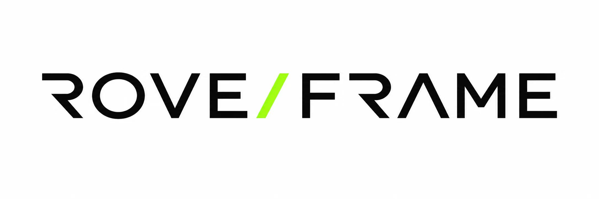
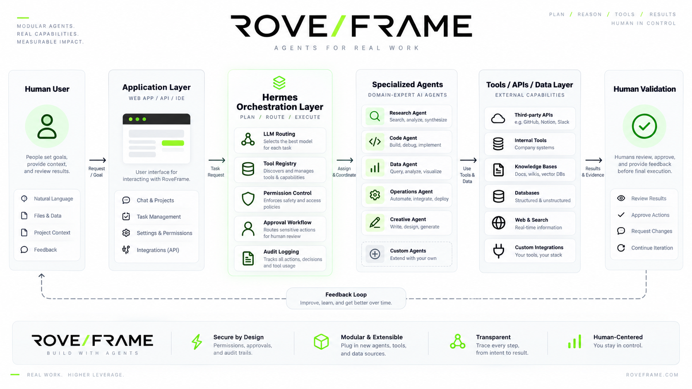
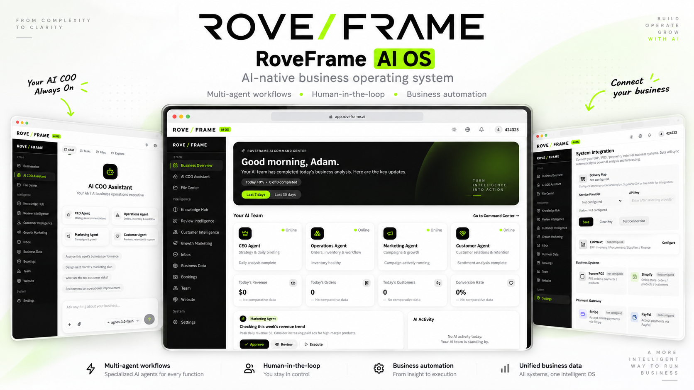
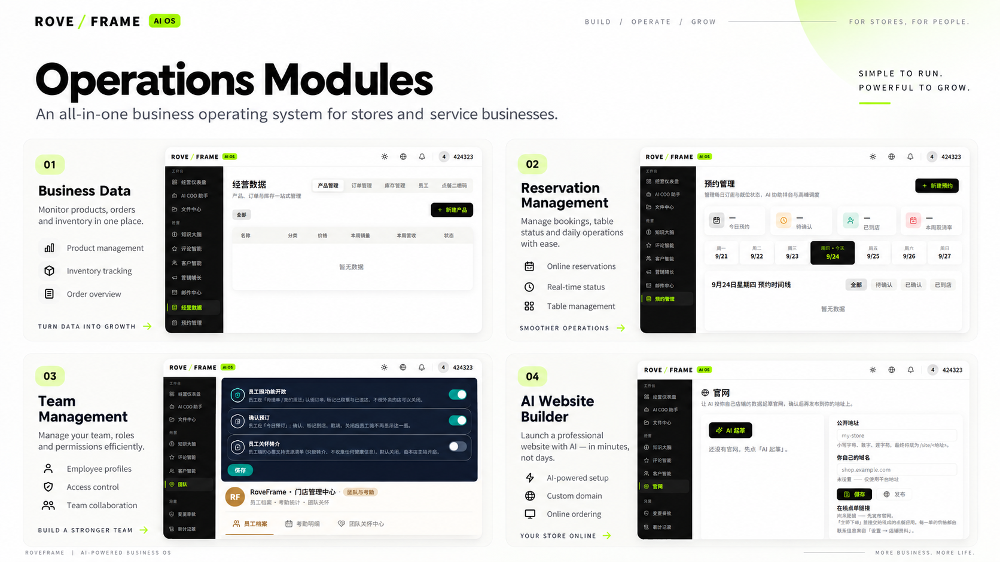
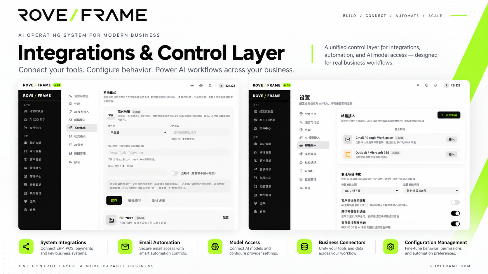
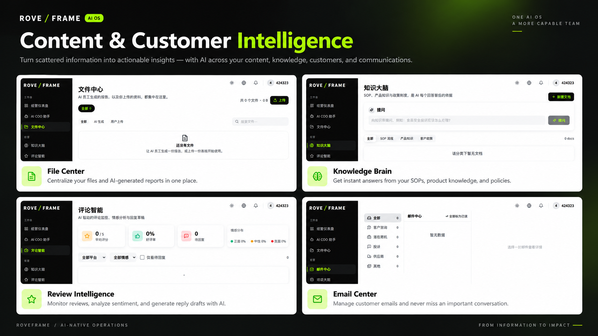
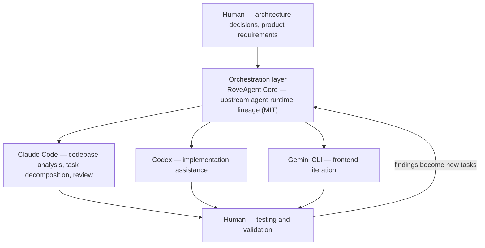

<div align="center">



# RoveFrame AI Business OS

**由多 Agent 工作流驱动的 AI 原生经营操作系统。**

Agent 负责做事，人保留最终决定权。

[English](README.md) · **简体中文** · [Español](README.es.md)

[](https://github.com/houjinlong258-oss/roveframe/actions/workflows/ci.yml)
[](LICENSE)


</div>

---

## 概述

RoveFrame 是面向中小企业的 **AI 经营操作系统**。它不是套在仪表盘外面的聊天机器人，
而是一个执行平台：LLM Agent 观察真实经营数据、提出具体动作建议，并且只有在人工审批之后，
才把这些动作真正落到真实系统上执行，同时留下审计记录。

首个垂直行业是餐饮：订单、菜单、客户、员工、配送、预约、营销与邮件，全部收在同一个经营界面里。
底层架构与行业无关——业务规则存在于配置层和提示词层，不在硬编码的分支里。

RoveFrame 是产品，也是**控制面**；**RoveAgent Core** 是智能与执行面。两者是各自独立的进程，
中间只有一份狭窄且经过认证的契约。

**本项目要解决的设计问题**，正是区分演示与系统的那个问题：一个能够*行动*的 LLM 就是一项负债，
除非你能对它做的每一个动作回答四个问题。

| 问题 | 本系统如何回答 |
|---|---|
| 谁被允许做这件事？ | 角色/权限矩阵，加上每个 Agent 各自的工具命名空间；在服务端解析，默认拒绝 |
| 是否有人工在环？ | 审批对象携带**冻结的参数**，由 owner 门禁，并且执行状态可见 |
| 实际发生了什么？ | 在执行*之前*和结果产生之后都写入持久化审计行——审计写入失败则整个操作失败 |
| 怎么知道它真的有效？ | 面向真实数据库的测试套件、schema 漂移预检，以及经机器校验的告警规则（见[工程实践](#工程实践)） |

<div align="center">

</div>

---

## 核心能力

**多 Agent 编排。** 具名 Agent 角色（CEO、运营、营销、客户、开发者、DevOps）各自获得明确的
工具命名空间与能力层级。一个角色只能触达被授予的工具，而且这道门禁是用代码强制执行的——
不是靠提示词里客气地请求模型遵守。

**Agent 工作流引擎。** 持久化任务队列，支持原子领取（`FOR UPDATE SKIP LOCKED`）、
崩溃 worker 的租约恢复、重试预算，以及按 tick 调度。长时间运行的工作不放在 HTTP 请求里。

**工具注册表。** 工具以输入 schema、所需权限与风险等级声明，然后通过唯一一个运行时调用；
该运行时按固定顺序施加门禁——**权限 → 审计 → 执行**——并带超时和结果记录。

**权限控制。** 角色/权限矩阵从数据库解析，另外对每个 Agent 角色再做一次命名空间校验。
请求携带经过验证的租户与 business 上下文，所有数据访问都按它限定作用域。
模型给出的参数永远无法自行选择这个作用域。

**审批工作流。** 敏感动作（退款、批量发送、部署）不会直接执行，而是生成一条审批。
参数在请求时就已冻结，所以被批准的正是被执行的。审批由 owner 门禁、会过期，并且可审计。

**人工在环校验。** Agent 给出的是*提案*，不是*既成事实*：在任何不可逆操作运行之前，
操作者能看到建议、推理依据和确切的载荷。

**审计日志。** 每一次特权写操作都会在执行前写入持久化的意图记录，并在执行后写入结果记录。
如果审计存储不可用，操作会失败即关闭，而不是在没有记录的情况下继续。

**LLM 集成。** 与厂商无关的路由层，支持按能力分配模型（`agent` / `content` / `rag` / `light`）、
跨厂商故障转移，以及平台内置回落，使客户在接入自己的 Key 之前产品仍然可用。
凭据以 AES-256-GCM 加密存储。

**工作流自动化。** 调度器驱动周期性工作：每日经营简报、异常告警、收件同步、外发发送队列、
Web Push 投递、配送位置保留期清理，以及任务队列轮询。

**多租户由构造保证。** 租户与 business 作用域不是约定：它由网络边界注入、在 handler 中复核、
由数据访问辅助函数再次强制执行，最后由 Postgres 行级安全兜底。

**三语产品界面。** 英语、中文与西班牙语，并配有一个键对齐测试：翻译一旦漂移，构建即失败。

---

## 产品界面

产品的四个视图——从 owner 的指挥中心一路到各功能模块。每个面板都以整宽展示，便于看清细节；
每一个都对应本仓库中真实存在的路由。

> **这些图是什么。** 产品概览图，由应用自身的界面渲染而来——不是线上部署的截图。
> 平台目前还没有公开源站（效果图浏览器边框里的 `app.roveframe.ai` 只是设计占位），
> 面板刻意展示空工作区，因此任何客户数据都不会被展示。真实、未经编辑的截图应当放在
> `docs/screenshots/`，该目录目前仍为空并说明了原因——见[那份说明](docs/screenshots/README.md)。

### 指挥中心与 AI COO



owner 的晨间简报：AI 团队夜里做了什么，营收 / 订单 / 客户 / 转化——在没有对比数据时诚实地显示
`no comparative data` 状态，而不是编造一个变化量——以及 Agent 名册（CEO、运营、营销、客户）
与各 Agent 的活动。旁边的 AI COO 助手基于同一批数据起草内容并推理。
→ `src/app/[locale]/dashboard`, `agent`

### 运营模块



日常经营界面：经营数据（产品、订单、库存）、带实时状态日历的预约、含角色与访问控制的团队管理，
以及员工中心（福利、考勤异常、关怀任务），还有为公开店面（自定义域名与在线点单）而做的
AI 建站。→ `business`, `reservations`, `team`, `website`

### 集成与控制层



在一个地方对接外部世界，并限定 Agent 能做什么：配送地图服务商、第三方服务凭据、
AI 模型接入（按能力路由）、ERPNext 连接、POS 与支付连接器——同页还有外发与收件邮箱设置、
发送速率与每日上限，以及客户自动回复、异常推送和每日简报的开关。
→ `settings`

### 内容与客户智能



知识与沟通界面：用于上传文件和存放 AI 生成报告的文件中心、基于你自己的 SOP 与制度作答
并给出引用的知识大脑、带情感分析与回复起草的评论智能，以及把来信分类为
inquiry / opportunity / complaint / supplier / other 的邮件中心。
→ `files`, `knowledge`, `reviews`, `emails`

---

## 系统架构

整个系统是两个平面，一份契约。

```
Human User
    ↓  natural language · files · project context
Application Layer            Next.js 16 (App Router, React 19, TypeScript strict)
    ↓  task request
Agent Orchestration Layer    RoveAgent Core — FastAPI runtime, capability registry & router
    ↓  assign & coordinate
Specialized Agents           CEO · Operations · Marketing · Customer · Developer · DevOps
    ↓  use tools & data
Tools / APIs / Data Layer    internal tools · connectors · knowledge base · web search · Postgres
    ↓  results & evidence
Human Validation             review · approve · request changes · continue iteration
    ↺  feedback loop  →  audit & memory  →  better next time
```

**控制面**（`src/`）——产品界面、租户与身份模型、审批与审计系统，以及整个数据访问层。
每个 HTTP 入口都要经过同一个网络边界：它认证会话、剥掉客户端伪造的上下文头，
并为下游 handler 注入经过验证的 `tenant_id` / `business_id` / `role`。

**执行面**（`roveagent/`）——Python 运行时，负责 agent 循环、能力发现、厂商故障转移、
工具执行与流式输出。它是独立进程，只监听内网端口；web 层通过共享密钥加 HMAC 签名的回调
与它通信。

两者之间的边界刻意做得很窄：web 层从不自行执行由模型驱动的动作，
运行时也不持有对业务表的特权写权限。

### 一次 Agent 动作的数据流

```
1. Request      → proxy authenticates, strips forged headers, injects verified scope
2. Handler      → central mutation guard: entitlement → tenant scope → permission
3. Intent       → durable audit row written BEFORE execution (failure ⇒ 503, fail closed)
4. Agent        → runtime resolves capability → tool registry → schema validation
5. Approval     → if the action is sensitive: frozen-argument approval, owner-gated
6. Execution    → tool runs under a timeout; result recorded
7. Outcome      → audit row written AFTER execution (failure ⇒ reported, never silent)
8. Evidence     → UI shows status; metrics expose counters; alert rules watch the backlog
```

---

## Agent 开发工作流

本仓库本身就是 AI 原生工程的一个例子：人负责架构与判断，Agent 负责覆盖面与迭代速度。



| 阶段 | 由谁负责 | 负责的内容 |
|---|---|---|
| 方向 | 人 | 架构、数据模型、安全边界、产品需求 |
| 编排 | 多 Agent 运行时 | 分派工作、维持上下文、协调各专用 Agent |
| 分析 | Claude Code | 阅读代码库、拆解任务、对结果做对抗性评审 |
| 实现 | Codex | 按明确契约做限定范围的实现 |
| 前端迭代 | Gemini CLI | UI 构建与视觉迭代 |
| 验证 | 人 | 跑门禁、判断证据、接受或拒绝结果 |

这个循环里不可让步的规则是：**在命令证明之前，Agent 的说法不算证据。**
本仓库中的每个守卫都必须在其守护的对象损坏时失败——一个无法失败的检查被视为缺陷，
而不是覆盖率。

---

## 技术栈

**前端**

| 技术 | 作用 |
|---|---|
| Next.js 16 (App Router) | 路由、服务端组件、路由处理器、自定义服务端入口 |
| React 19 | UI |
| TypeScript 5 (strict) | 全应用类型安全，不使用隐式 `any` |
| Tailwind CSS 4 + shadcn/ui (Radix) | 设计系统，50+ 个 UI 基础组件 |
| next-intl | en / zh / es，并强制键对齐 |
| Serwist | PWA service worker（目前在 Turbopack 下已禁用——见 `next.config.ts`） |
| Recharts · react-markdown | 仪表盘图表、Agent 流式输出 |

**后端**

| 技术 | 作用 |
|---|---|
| Next.js 路由处理器 | 132 个 API handler |
| Node 自定义服务端（`src/server.ts`） | 调度器、启动预检、自动迁移、进程级守卫 |
| Python 3.11–3.13 · FastAPI · uvicorn | RoveAgent Core 执行面 |
| TypeScript agent-runtime 原语 | 迭代预算、重复守卫、工具调用规范化 |
| zod | 所有请求体与工具输入 schema |

**数据**

| 技术 | 作用 |
|---|---|
| Supabase Postgres | 52 张表，唯一事实来源 |
| 行级安全（Row-Level Security） | 每个 public 表都已启用，且各自带显式策略 |
| PostgREST · GoTrue · Storage | 数据访问、身份、媒体 |
| 服务端 `service_role` | 特权访问，绝不下发到浏览器 |
| AES-256-GCM（`src/lib/crypto.ts`） | 对模型服务商、邮箱与集成凭据做静态加密 |

**AI / LLM**

| 技术 | 作用 |
|---|---|
| 与厂商无关的路由器 | `agent` / `content` / `rag` / `light` 四种能力，按能力分配模型 |
| 10 家服务商预设 | Anthropic、OpenAI、Gemini、DeepSeek、Doubao、Kimi、Qwen、GLM、Grok，外加一个自定义 OpenAI 兼容端点 |
| 故障转移链 | 显式的降级策略，而不是静默重试 |
| 嵌入 + pgvector | 知识库的 1024 维检索 |
| 工具调用循环 | 权限 → 审计 → 执行，并带超时 |

**基础设施**

| 技术 | 作用 |
|---|---|
| Docker Compose | 两个服务：`web`（:5000，公开）与 `roveagent`（:8788，仅内网） |
| Dockerfile | 每个平面各自构建镜像；不烘焙任何密钥 |
| Caddy | 为商家站点提供 TLS 与按需证书 |
| Prometheus 文本端点 | `/api/metrics`，外加 13 条带机器校验器的告警规则 |
| GitHub Actions | 3 个 CI job：TypeScript 门禁、Linux Python 安装 + 测试套件、两个容器构建 |

---

## 项目结构

```
src/
  app/
    [locale]/            24 route groups — dashboard, agent, approvals, audit, knowledge,
                         reviews, customers, marketing, emails, business, reservations,
                         settings, team, staff, enterprise, files, store, site, website,
                         onboarding, admin, auth, unsubscribe, (marketing)
    api/                 132 route handlers
  components/            feature-grouped UI (agent, customer, delivery, layout, owner,
                         settings, staff, site, pwa, workspace, ui)
  lib/
    agent/               approvals, missions, registry, audit, personas
    enterprise/          agent roles, tool runtime, memory layers
    ai/  security/  payments/  email/  notifications/  observability/  connectors/
    tenant-db.ts         scoped data-access helpers
    mutation-guard.ts    central authenticate → scope → permission → intent → execute gate
  proxy.ts               network boundary: session check, header sanitisation, request id
roveagent/               RoveAgent Core — Python execution plane
  api/                   FastAPI app, capability registry/providers/router, plugin security
  tools/  skills/  plugins/  workforce/  tenant/  connectors/  gateway/
packages/roveagent-core/ TypeScript agent-loop primitives + third-party attribution manifest
scripts/                 migrations, validation gates, operational tooling
tests/                   118 TypeScript test files
docs/                    architecture, operations, engineering audit reports, assets
ops/alerts/              Prometheus alert rules
docker/                  deploy env templates, Caddy, database helpers
messages/                English, Chinese and Spanish product messages
```

---

## 开发

### 前置条件

| 工具 | 版本 |
|---|---|
| Node.js | 22 |
| pnpm | 9 或更新（npm 与 yarn 会被 `preinstall` 守卫拒绝） |
| Python | 3.11 – 3.13 |
| Docker | 可选，用于容器路径 |

### 安装

```bash
git clone https://github.com/houjinlong258-oss/roveframe.git
cd roveframe

pnpm install --frozen-lockfile           # web tier
pip install -e "./roveagent[web]"        # execution plane, with the FastAPI extras
```

### 环境配置

所有凭据都在运行时提供；镜像里不烘焙任何凭据，也不提交任何凭据。
切勿把本地环境文件或凭据值提交到仓库。

```bash
cp .env.example .env                             # web tier
cp docker/deploy.env.example docker/deploy.env   # container path
```

最重要的几个变量：

| 变量 | 用途 |
|---|---|
| `COZE_SUPABASE_URL` / `_ANON_KEY` / `_SERVICE_ROLE_KEY` | 项目端点与密钥。service-role key **仅限服务端**。 |
| `COZE_SUPABASE_JWT_SECRET` | 启用本地 JWT 校验，为每个请求省掉一次往返。 |
| `ENCRYPTION_SECRET` | 用于数据库中存储凭据的 AES-256-GCM 密钥（32+ 个字符）。可通过 `ENCRYPTION_SECRET_PREVIOUS` 轮换。 |
| `ROVEAGENT_API_KEY` / `ROVEAGENT_APPROVAL_SECRET` | 服务间认证。若这两者相同，运行时**拒绝启动**——否则持有调用方密钥就等于同时获得签署审批回调的权限。 |
| `ROVEAGENT_LLM_API_KEY` | Agent 运行时使用的服务商密钥。 |

### 本地运行

```bash
pnpm dev                # development server (port from .preview, default 5000)

python scripts/run-python-tests.py     # execution-plane suite (offline, no provider spend)
pnpm validate                          # the full gate
```

`pnpm validate` 会跑迁移契约、TypeScript、lint（代码与样式）、完整测试套件和生产扫描。
在它以 0 退出之前，改动都不算完成。

也可以单独运行各个专项门禁：

```bash
pnpm scan:secrets   # credential scan — reports locations only, never values
pnpm scan:brand     # placeholder-brand leakage
pnpm scan:globals   # accidental globals
pnpm scan:artifacts # stray build artifacts
pnpm build          # production build (Next.js + custom server bundle)
```

容器路径：

```bash
docker compose --env-file docker/deploy.env up -d --build
curl -fsS http://localhost:5000/api/health
```

### 数据库

数据库改动都是增量的，位于 `scripts/migrate.sql` 以及 `scripts/` 下各专项迁移文件。
执行任何操作之前先确认目标项目：

```bash
npx tsx scripts/run-migrate.ts
```

不要对未确认身份或未经验证的数据库目标执行迁移。

### 源码交付

源码归档基于显式白名单生成，并写到仓库之外。打包器在写文件之前会先跑生产扫描：

```bash
pnpm package:source -- --output ../roveframe-ai-business-os-source.zip
```

---

## 部署

**支持两条路径。选一条，不要混用。** 区别在于数据库放在哪里。

| | 路径 A——内置数据库 | 路径 B——外部 Supabase |
|---|---|---|
| 命令 | `bash install.sh` | `docker compose --env-file docker/deploy.env up -d --build` |
| 数据库 | 容器内的 Postgres 17，外加 PostgREST、GoTrue 与 Storage | 你自己的 Supabase 项目 |
| 凭据 | 自动生成并写入 `docker/deploy.env`（权限 600） | 由你填写每一个标记为 REQUIRED 的值 |
| 适用场景 | 裸服务器、自托管、不需要任何注册 | 已有 Supabase 项目、需要托管备份 |
| Compose 文件 | `docker-compose.yml` + `docker-compose.selfhosted.yml` | `docker-compose.yml` |

### 路径 A——在裸服务器上一条命令完成

```bash
git clone https://github.com/houjinlong258-oss/roveframe.git
cd roveframe
bash install.sh --domain app.example.com --email ops@example.com --llm-key sk-...
```

`install.sh` 会在 Caddy 后面拉起整个平台，并自动配置 HTTPS：

| 容器 | 作用 |
|---|---|
| `db` | `supabase/postgres:17.6.1.136`——数据库，使用具名卷 |
| `rest` | PostgREST `v14.17`——应用所访问的数据 API |
| `auth` | GoTrue `v2.196.0`——身份服务（以 autoconfirm 运行，因此不需要邮件中继） |
| `storage` | Storage API `v1.74.0`——商品图片与视频 |
| `gateway` | nginx `1.27-alpine`——**只**对外暴露 `/storage/v1/object/public/*`；PostgREST 与 GoTrue 无法从公网访问 |
| `edge` | Caddy `2-alpine`——TLS，为商家自定义域名按需签发证书 |
| `web` | Next.js 控制面（绑定 `127.0.0.1:5000`；所有对外流量都经过 `edge`） |

常用参数：Docker Hub 被墙时用 `--registry docker.m.daocloud.io/`；
`--admin-email` / `--admin-password` / `--business "My Shop"` 用于创建第一个 owner 账号；
`--yes` 用于无人值守安装。

它是**幂等的**——重复运行会保留已有的 `docker/deploy.env`，因此不会在用户已登录的情况下
把 JWT secret 悄悄轮换掉，也不会在卷初始化之后更改数据库密码——并且它**失败时会明确报错**：
每个等待都有截止时间，超时会打印容器日志。

它刻意**不**碰 DNS（请先把 A/AAAA 记录指向服务器，或者安装时不带 `--domain`，
改用 `http://<server-ip>`），也不会配置邮件中继。

### 路径 B——外部 Supabase

```bash
cp docker/deploy.env.example docker/deploy.env
# fill in every value marked REQUIRED, then:
docker compose --env-file docker/deploy.env up -d --build
```

### 生产环境的要求

其中有三项会让应用**拒绝启动**，而不是在半配置状态下运行：

| 变量 | 说明 |
|---|---|
| `COZE_SUPABASE_URL` / `_ANON_KEY` | 项目端点与公开密钥 |
| `COZE_SUPABASE_SERVICE_ROLE_KEY` | **生产环境必需**——缺少它 web 服务拒绝启动。仅限服务端，绝不下发到浏览器 |
| `COZE_SUPABASE_JWT_SECRET` | 建议设置：在本地校验会话，而不是每个请求都往返一次 |
| `ENCRYPTION_SECRET` | **生产环境必需。** 用于存储凭据的 AES-256-GCM 密钥，32+ 个字符。必须与 service-role key **不同**——复用会导致轮换数据库凭据后，所有已存密钥永久无法解密。通过 `ENCRYPTION_SECRET_PREVIOUS`（仅用于解密）轮换 |
| `ROVEAGENT_API_KEY` / `ROVEAGENT_APPROVAL_SECRET` | 服务间认证。两者必须是**不同的值**：相同时运行时会返回 503，以确保持有调用方密钥不会同时获得审批签名权限 |
| `ROVEAGENT_LLM_API_KEY` | 缺少它时 Agent 运行时返回 503，而不是编造一个回答 |
| `NEXT_PUBLIC_APP_URL` | 公开源站——运行时读取，不烘焙进镜像 |
| `SITE_DOMAIN` | 为空表示仅用 IP 安装 |
| 平台模型（`ROVEFRAME_PLATFORM_LLM_*`） | 可选，但自托管安装值得配置：没有平台模型时，`model_assign` 为 `auto` 的**新注册**租户没有可用模型，因为注册只创建 tenant、business、user 与 profile，不会创建 `settings` 行 |

### 健康检查、就绪与指标

镜像自带就绪探针，因此编排器无需额外接线：

```
HEALTHCHECK --interval=30s --timeout=20s --start-period=90s --retries=3
  → fetch http://127.0.0.1:5000/api/health     (non-2xx ⇒ unhealthy)
```

除非以下三项同时成立，否则 `/api/health` 返回 **503**——线上 schema 与预期的
52 张表 / 600+ 列一致、Agent 运行时能作答、调度器心跳是新的。这意味着
「容器起来了，但数据库漂移了」正是那种会停止接收流量的状态。

```bash
curl -fsS http://localhost:5000/api/health            # 200 when ready, 503 with reasons when not
curl -fsS -H "X-RoveAgent-Key: $ROVEAGENT_API_KEY" \
     http://localhost:5000/api/metrics                # Prometheus text format
```

`ops/alerts/roveframe.rules.yml` 里有 13 条可直接加载的告警规则（可用性、调度器、队列积压、
支付、内存），并配有一个零依赖校验器：

```bash
node scripts/check-alert-rules.mjs --base http://localhost:5000 --key "$ROVEAGENT_API_KEY"
```

### 首次启动时的 schema 创建与迁移

`autoMigrate()` 会执行全部 **20** 个迁移文件（幂等：`create … if not exists`、
`add column if not exists`、`drop policy if exists` + `create policy`），随后由预检查验证结果。
它只在生产入口点运行——`next start` **不会**加载 `src/server.ts`，因此不会做任何迁移。

迁移需要 `DATABASE_URL` / `POSTGRES_URL` / `DIRECT_URL` / `COZE_SUPABASE_DATABASE_URL` /
`SUPABASE_DATABASE_URL` / `PG_CONNECTION_STRING` 中的**一个**，或者 `SUPABASE_ACCESS_TOKEN`。
缺少这些时进程仍会启动，并明确打印日志：

```
⚠️ [migrate] 未配置 DATABASE_URL 或 SUPABASE_ACCESS_TOKEN，跳过自动建表。
✓ [boot-check] 数据库 schema 完整
```

这就是安全的失败模式：拒绝猜测、说明缺了什么，并让 `/api/health` 报告后果。

### 自定义域名（商家店面）

商家在应用里绑定自己的域名；Caddy 按需签发证书，并先询问应用，
因此这台服务器永远不会被用来为任意主机名签发证书：

```caddyfile
on_demand_tls { ask http://web:5000/api/site/authorize }
```

只有当主机名匹配 `SITE_DOMAIN`，或者匹配 `public_sites` 中 `custom_domain` 处于激活
*且*启用状态的一行时，该端点才返回 **200**；其他情况一律 404，失败即关闭。
有一个接线测试断言这个 `ask` 路径确实存在路由，并且在公开白名单中，
因为这里的一个拼写错误会静默失败：Caddy 会把任何非 2xx 当作拒绝，
于是每个商家域名都只是永远拿不到证书。

### 扩容约束：只跑单副本

限流与对话并发槽位都存在进程内存里，所以当前构建**按定义就是单副本**。
设置 `ROVEFRAME_RATE_LIMIT_SHARED=1` 是在*声明*存在共享后端，而不是一个开关——
如果设了它却没有共享后端，启动时的契约检查会明确报错。同理，
拥有调度器的进程只能跑一个；跑第二个会让 tick 翻倍。

### 部署后检查清单

1. `curl -fsS http://<host>/api/health` → 200（503 表示 schema 漂移或运行时不可达；
   响应里会写明是哪一种）。
2. 用 `install.sh --admin-email` 创建的 owner 账号登录，或者用
   `npx tsx scripts/ensure-initial-user.ts` 创建/重置一个（幂等；账号已存在则重置密码）。
3. `curl -H "X-RoveAgent-Key: …" /api/metrics` → 计数器存在，且每个 collector 的
   `roveframe_metrics_collection_ok` 都为 1。
4. 抓取 `/api/metrics` 并加载 `ops/alerts/roveframe.rules.yml`——没有这一步，
   调度器停滞或队列增长都是不可见的。
5. 轮换安装过程中生成或共享过的所有凭据，然后重新检查健康状态。

---

## 工程实践

这是本项目最值得去读代码的部分。仓库把**验证当作一等功能**，其中有几个守卫之所以存在，
正是因为本项目早期的一个版本发布过一个任何测试都看不见的缺陷。

| 实践 | 在本项目中的含义 |
|---|---|
| 默认失败即关闭 | 审计存储不可达时，写操作失败。schema 检查读不到数据库时，它报告的是*失败*，而不是*健康*。 |
| 守卫必须能够失败 | 每个守卫都通过「回退修复、确认守卫变红」来验证。一个无法制造出失败的检查，会被报告为什么都证明不了。 |
| 面向真实数据库的不变量 | 行级安全覆盖率是针对真实数据库断言的——既断言「每张表都有 RLS」，也断言「没有哪张表启用了 RLS 却一条策略都没有」——而不是针对迁移文本断言。 |
| schema 漂移检测 | 启动预检从 schema 定义推导预期，再与线上数据库比对（52 张表 / 600+ 列），而不是维护一份手写的子集。 |
| 引用真实指标的告警规则 | 零依赖校验器会拒绝任何引用了代码库未导出指标的规则，并与线上指标端点交叉核对。 |
| 资金路径按行为测试 | 货币小数位（零位、两位与三位小数货币）、带显式正向对照的签名验证，以及幂等性，都是通过实际执行代码来断言的。 |
| 诚实的文档 | 审计报告会说明哪些*尚未*完成。当某个测试需要并不存在的凭据时，会报告为 `UNVERIFIED`，而不是静默通过。 |

当前 checkout 的门禁状态：**1,461 个 TypeScript 测试**（0 失败）、**815 个 Python 测试**
（0 失败），并且生产扫描在整棵代码树上干净通过（2,500+ 个文件）。

---

## 项目状态

**尚未发布（pre-launch）。** 这是一个可以运行的系统，端到端地构建与运营——不是原型。
它同时也如实说明自己的边界：

- **已实现，并在真实数据库上实际跑过**：多租户、RBAC、审批与审计流程、Agent 运行时、
  调度器、配送与员工相关流程、邮件与推送。
- **目前刻意保持人工**：商家计费。订阅由运营人员配合线下付款记录开通。
  自动化的周期计费是一个尚未做出的产品决策。
- **在当前环境中尚未验证**：真机 iOS/Safari 行为、与支付服务商的真实往返（没有商家凭据），
  以及社交发布能力（已实现并测试，但还没有接入工具注册表）。

本项目中没有出现任何用户数、营收数字或客户名称，因为没有什么可报告的。

---

## 后续路线图

可能的方向，大致按优先级排序。这里没有任何一项被声称已经做完。

- **更多 Agent 能力**——扩充工具注册表，并把已实现但未接线的社交发布界面接上。
- **更好的工作流自动化**——把剩余的请求期工作移入持久化任务队列；更丰富的调度原语。
- **更多集成**——把 ERP 适配器从「能连通」做到完整；在现有 webhook 契约之后
  增加更多 POS 与支付连接器。
- **水平扩容**——把进程内的限流与并发状态换成共享后端。
  相关的部署契约已经在启动时断言。
- **运维**——日志聚合与链路追踪；指标与告警这一侧已经存在。

---

## 许可证

MIT——见 [LICENSE](LICENSE)。

`roveagent/` 派生自一个以 MIT 许可证发布的上游 agent 运行时
（Copyright © 2025 Nous Research）。原始许可证文本与完整的署名清单——
其中明确写明了上游项目名称——保留在 [`roveagent/NOTICE`](roveagent/NOTICE)、
[`roveagent/LICENSE`](roveagent/LICENSE) 与
[`packages/roveagent-core/THIRD_PARTY_NOTICES.md`](packages/roveagent-core/THIRD_PARTY_NOTICES.md)。
第三方许可证与署名文本**只**保留在这些指定位置，仓库的品牌扫描按设计对它们豁免；
这也是本 README 指向它们、而不是在这里重复署名的原因。

企业层——租户、RBAC、审批、审计、连接器与产品界面——是本仓库的原创工作。

<div align="center">
<sub>由 Agent 构建，掌握在人手中。</sub>
</div>
