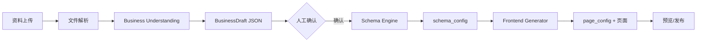
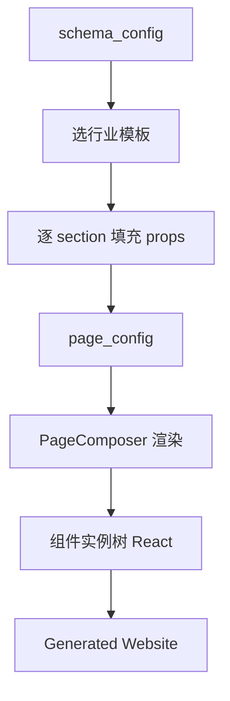

# RoveFrame AI 生成系统 · 详细设计

> 本文档是《RoveFrame AI Business Generator V2.0 技术白皮书》的子系统详设，
> 聚焦「企业资料 → AI 理解 → 业务 Schema → 前端生成」这条生成管线。
> 读者：负责实现 Business Understanding Agent、Schema Engine、Frontend Generator 的工程师。

---

## 1. 概述与硬性原则

**目标**：把用户上传的企业资料，自动变成一套「可运行、可预览、可部署」的数字化商业系统。

**三条硬性原则（任何实现不得违背）**：

1. **AI 产「配置 + 内容」，不产源码。** 生成系统输出的是一份结构化配置（`schema_config`），
   由固定的组件库解释渲染。稳定性和安全性来自组件库，不是来自「AI 写的代码」。
2. **可解释、可回滚、可人工确认。** 每个阶段产物都是可读的 JSON，可在预览后人工修改再发布。
3. **生成与运行分离。** 生成期（理解+Schema+渲染）用轻量/内容模型控成本，
   运行期（AI COO）用旗舰模型做分析。

---

## 2. 生成管线（Pipeline）



| 阶段 | 模块 | 输入 | 输出 |
|---|---|---|---|
| 1 | 上传/解析器 | PDF/Excel/图片/文本 | 结构化文本/表格/图片文案 |
| 2 | Business Understanding Agent | 解析结果 | `BusinessDraft` |
| 3 | Schema Engine | `BusinessDraft` | `schema_config` |
| 4 | Frontend Generator | `schema_config` | `page_config`（渲染用） |

---

## 3. 核心数据结构（TypeScript）

### 3.1 BusinessDraft（理解阶段的输出）

```ts
interface BusinessDraft {
  industry: 'restaurant' | 'retail' | 'beauty' | 'service' | string;
  business_name: string;
  style: string;            // 视觉风格：modern / classic / warm / minimal
  language: string;         // en / zh / es
  currency: string;         // USD
  contact?: { phone?: string; address?: string; email?: string };
  entities: string[];       // 需要的实体：product/order/reservation/tip/...
  products?: Array<{
    name: string;
    price: number;
    category: string;
    description?: string;
    image_url?: string;
  }>;
  services?: Array<{ name: string; price: number; duration_min?: number; description?: string }>;
}
```

### 3.2 schema_config（生成系统的核心产物）

```ts
interface SchemaConfig {
  version: number;                  // schema 版本，用于迁移/回滚
  industry: string;
  business_name: string;
  locale: string;
  currency: string;
  entities: EntityDef[];
  navigation: NavItem[];
  theme: ThemeTokens;
  pages: PageConfig[];
}

interface EntityDef {
  name: string;                     // product / order / reservation / tip
  label: string;
  fields: FieldDef[];
  capabilities: string[];           // 如 ['cart', 'tip', 'reserve']
}

interface FieldDef {
  name: string;                     // price / stock / duration_min
  type: 'text' | 'number' | 'text' | 'image' | 'select' | 'boolean';
  required?: boolean;
  options?: string[];               // select 的候选值
}

interface NavItem { key: string; label: string; icon?: string; target: string; }

interface ThemeTokens {
  primary: string;
  background: string;
  surface: string;
  radius: 'sm' | 'md' | 'lg';
  font: string;                     // 字体族 token
}

interface PageConfig {
  id: string;
  route: string;                    // '/', '/menu', '/about', '/reserve'
  title: string;
  sections: SectionConfig[];
}

interface SectionConfig {
  type: string;                     // 组件类型，见 §6
  props: Record<string, unknown>;   // 组件配置，见各组件 schema
}
```

### 3.3 三者关系

```
BusinessDraft ──(Schema Engine 填实体/字段)──> schema_config
                                                 │
                                      (Frontend Generator 解释)
                                                 ▼
                                          page_config（组件树）→ 渲染
```

---

## 4. Business Understanding Agent 详细设计

### 4.1 文件解析器（阶段 1）

| 类型 | 解析方案 | 产物 |
|---|---|---|
| PDF | `pdf.js` 抽文本 + 表格 | 结构化文本 |
| Excel/CSV | `SheetJS` | 商品/服务行（name, price, category） |
| 图片 | 视觉模型 OCR（或本地 OCR） | 文本 + 图片 URL |
| 文本 | 直接结构化 | 文本 |

> 图片理解需要视觉模型能力；当前 `ai/router.ts` 是文本协议，落地时需扩展 `ChatMessage` 支持 image 内容块
> （Claude 走 content block，OpenAI 兼容走 `image_url`）。

### 4.2 Agent 设计

- **能力档位**：`content`（轻量，控制成本）。
- **输入**：解析后的文本/表格（作为 user 消息直出）。
- **输出契约**：严格 JSON，匹配 `BusinessDraft`。
- **Prompt 要点**：要求输出纯 JSON（禁 Markdown 代码块）、按行业实体字典归类。

示意 System Prompt：

```
你是企业业务理解引擎。把用户上传的企业资料解析为 JSON，只输出 JSON。
- industry 只能是 restaurant/retail/beauty/service 之一
- 尽量抽取商品/服务的 name/price/category
- 用企业语言字段 language，货币字段 currency
- 不要编造信息，资料里没有的字段省略
```

### 4.3 校验与兜底

- `JSON.parse` 失败 → 用正则兜底抽取关键字段，仍失败则回退「人工填写」路径。
- 输出进入「确认页」：AI 结果可编辑，用户确认后才进 Schema Engine。

---

## 5. Schema Engine 详细设计

### 5.1 行业实体字典（确定性规则，非 LLM 生成）

```ts
export const INDUSTRY_ENTITIES: Record<string, EntityDef[]> = {
  restaurant: [
    { name: 'product',    label: '菜品',  fields: [price, category, description, image], capabilities: ['cart', 'tip'] },
    { name: 'category',   label: '分类',  fields: [name] },
    { name: 'order',      label: '订单',  fields: [items, total, status, table_no] },
    { name: 'reservation',label: '预约',  fields: [customer, party_size, reserved_at] },
    { name: 'tip',        label: '小费',  fields: [amount, percent, staff_id] },
  ],
  beauty: [
    { name: 'service',    label: '服务',  fields: [price, duration_min, description] },
    { name: 'appointment',label: '预约',  fields: [customer, staff_id, start_at] },
    { name: 'staff',      label: '员工',  fields: [name, title, photo] },
  ],
  retail: [
    { name: 'product',    label: '商品',  fields: [price, stock, category, image] },
    { name: 'inventory',  label: '库存',  fields: [stock, safety_stock, supplier] },
    { name: 'promotion',  label: '促销',  fields: [type, discount, starts_at, ends_at] },
  ],
  service: [
    { name: 'service',    label: '服务',  fields: [price, duration_min] },
    { name: 'booking',    label: '预约',  fields: [customer, start_at] },
  ],
};
```

- Schema Engine 是**确定性函数**：`BusinessDraft.industry` + `entities` → 从字典取 `EntityDef`。
- LLM 只负责「抽取内容」，**不负责定义结构**（结构来自字典，保证稳定）。
- `BusinessDraft.products` 直接映射为 `schema_config` 的初始数据。

### 5.2 产物落库

- `schema_config` 存入 `businesses.schema_config`（jsonb），带 `version`。
- 数据初始化：`products`/`services` 等由部署引擎写入对应业务表。

---

## 6. 组件库设计（Component Library）

### 6.1 组件注册表

```ts
export const COMPONENT_REGISTRY: Record<string, ComponentDef> = {
  hero:             { schema: ['title', 'image', 'button_label', 'button_href'] },
  product_grid:     { schema: ['category_filter', 'columns', 'items'] },
  product_card:     { schema: ['name', 'price', 'image', 'badge'] },
  category_nav:     { schema: ['categories'] },
  cart_bar:         { schema: ['label', 'cta'] },
  review_list:      { schema: ['platform_filter', 'limit'] },
  reservation_form: { schema: ['fields', 'cta', 'branch_hours'] },
  gallery:          { schema: ['images'] },
  footer:           { schema: ['business_name', 'contact', 'socials'] },
};

interface ComponentDef {
  schema: string[];        // 允许的配置键
  dataBinding?: string;    // 绑定的数据源（如 products）
}
```

### 6.2 组件示例：ProductCard

```ts
// 固定受控组件，只吃 props，不写死业务
interface ProductCardProps {
  name: string;
  price: number;
  image?: string;
  badge?: string;
  currency: string;
}
```

- AI 只产出 `SectionConfig = { type: 'product_card', props: { name, price, image } }`。
- 组件渲染由固定代码完成，确保安全可维护。

### 6.3 组件能力（capabilities）

- `cart`：商品可加入购物车（触发 `api/store/orders`）。
- `tip`：下单后出现小费/员工选择（复用已有 Tip/Staff 逻辑）。
- `reserve`：预约表单提交。

---

## 7. 模板系统（Industry Templates）

模板 = **默认组件序列** + **主题令牌** + **默认文案**。

```ts
export const INDUSTRY_TEMPLATES: Record<string, PageConfig[]> = {
  restaurant: [
    { id: 'home', route: '/', title: '首页',
      sections: [ { type: 'hero' }, { type: 'category_nav' }, { type: 'product_grid' }, { type: 'review_list' }, { type: 'footer' } ] },
    { id: 'menu', route: '/menu', title: '点餐',
      sections: [ { type: 'category_nav' }, { type: 'product_grid' } ] },
    { id: 'reserve', route: '/reserve', title: '预约',
      sections: [ { type: 'reservation_form' } ] },
  ],
  beauty: [ /* hero + service_grid + appointment_form + footer */ ],
  retail: [ /* hero + promotion_banner + product_grid + footer */ ],
  service: [ /* hero + service_grid + booking_form + footer */ ],
};
```

**Frontend Generator 的职责**：根据 `schema_config.industry` 选模板 → 用 `schema_config` 的内容填充各 `SectionConfig.props` → 输出最终 `page_config`。

---

## 8. Frontend Generator 详细设计



- **PageComposer**：遍历 `page_config.sections`，按 `section.type` 从 `COMPONENT_REGISTRY` 取组件并传入 `props`。
- **主题**：`schema_config.theme` → CSS 变量（与现有 `globals.css @theme` 对齐）。
- **数据绑定**：`product_grid` 的 `items` 先从 `schema_config` 初始数据注入，运行期再切换为 API 拉取。

---

## 9. 版本化 · 校验 · 回滚

- `schema_config.version` 递增；每次重新生成产生新版本。
- 生成后做 **schema 校验**（字段/组件类型合法、必需字段齐全）。
- 预览环境渲染 → 人工确认 → 发布；发布前旧版本可一键回滚（`businesses.schema_config` 保留上一版本）。

---

## 10. AI 成本与安全

- **能力分档**：理解/文案/结构化 → `content`/`light`；AI COO 分析 → `agent`/旗舰。
- **缓存**：同一资料重复理解的中间产物（解析文本）落临时存储，避免重复 OCR/LLM。
- **安全**：所有生成动作写 `audit_logs`；AI 不可触碰财务写路径。

---

## 11. 与现有代码的关系（落地锚点）

| 现有能力 | 复用方式 |
|---|---|
| `lib/ai/router.ts` | 理解/文案走 `content`，COO 走 `agent` |
| `lib/skills.ts` | 行业能力词典，Schema Engine 的实体字典可扩展于此 |
| `api/upload` + Storage | 资料附件上传复用 |
| `api/business/products/generate` | 商品内容生成是「理解 Agent」的简化前缀 |
| `lib/settings.ts` | 品牌/语言/货币 → `theme` + `locale` |
| tip/staff 逻辑 | 组件 `capabilities: ['cart','tip']` 直接挂接 |

---

## 12. 落地切分（对应白皮书 Sprint S5–S10）

| Sprint | 交付 |
|---|---|
| S5 | 上传中心 + 解析器（PDF/Excel/图片/文本） |
| S6 | Business Understanding Agent（资料 → BusinessDraft）+ 确认页 |
| S7 | Schema Engine（BusinessDraft → schema_config）+ 行业实体字典 |
| S8 | 组件库骨架（hero/product_card/category_nav/cart_bar）+ 模板 |
| S9 | Frontend Generator（schema_config → page_config → 页面） |
| S10 | 端到端打通「上传 → 生成 → 预览」+ 版本/回滚 |

---

## 13. 待决事项（需产品/模型决策）

1. **图片理解的模型选型**：接视觉模型（多模态消息），还是先文本+人工补录，图片理解后置？
2. **预览环境**：生成后预览走「临时渲染」还是「独立预览子域」？
3. **schema_config 的可编辑粒度**：确认页改成「整 JSON 编辑」还是「分步表单」？

---

*本文档与《技术白皮书》配套：白皮书管架构与优先级，本文档管「AI 生成系统」的实现细节。*