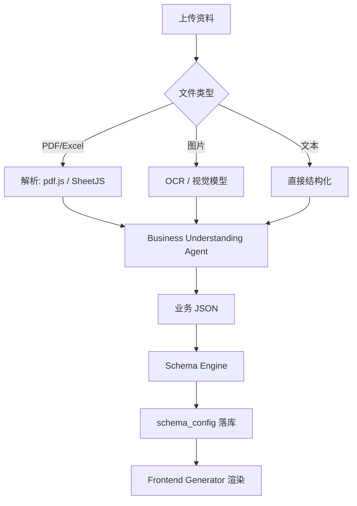

# RoveFrame AI Business Generator V2.0 技术白皮书

> 面向技术团队交付的工程执行版。本文档以「先平台化、再生成、后生态」为总原则，
> 与 MVP 阶段的实际代码基线对齐，明确架构、数据、API、Agent 工作流、部署与 Sprint 拆解。

---

## 0. 产品定位与目标

RoveFrame 是面向全球中小实体企业的 **AI 原生商业系统生成平台**：

```
企业资料上传 → AI 理解业务 → 生成商业 Schema → 渲染前端/后台 → 自动部署 → AI COO 持续经营
```

**核心原则**：AI 生成的是「配置 + 内容」，不是随机代码。系统稳定性来自
`行业模板 + 组件库 + AI 配置`，而不是让模型直接写源码。

### 开发优先级（本文档的骨架）

| 优先级 | 内容 | 目标 |
|---|---|---|
| **P0** | 多租户、Business Entity、权限、Audit Log | 从「单店 SaaS」变成「N 企业平台」 |
| P1 | 资料上传解析、Business Understanding Agent、Schema Engine、模板系统 | 生成能力的核心 |
| P2 | 自动部署、AI COO 运行时 | 商业价值兑现 |
| P3 | 生态（Marketplace / AI Workforce） | 长期终局 |

---

## 1. 技术架构总览

```
┌─────────────────────────────────────────────────────────────┐
│                     Presentation（前端）                     │
│   Next.js App Router · React 19 · Tailwind · shadcn/ui        │
│   商家 Angular/店前端  ·  平台后台  ·  商家 H5 商城             │
└─────────────────────────────────────────────────────────────┘
                              │ HTTPS / RSC / API
┌─────────────────────────────────────────────────────────────┐
│                     Application（后端）                       │
│   Next.js Route Handlers · 自定义 server.ts · SSE 流式         │
│   AI Router（agent/content/rag/light）· Scheduler             │
└─────────────────────────────────────────────────────────────┘
              │                    │                    │
┌──────────────┐  ┌────────────────┐  ┌──────────────────┐
│  PostgreSQL   │  │  AI 服务       │  │  外部集成        │
│  Supabase     │  │  LLM 路由      │  │  Stripe/Square   │
│  pgvector     │  │  10 家服务商    │  │  WhatsApp/邮件等 │
└──────────────┘  └────────────────┘  └──────────────────┘
```

- **框架**：Next.js 16（自定义 `server.ts` 入口，`tsup` 打包为单进程 Node 服务）。
- **数据**：Supabase（PostgreSQL + pgvector 1024 维），服务端 `service_role` 无用户态 Auth；多租户隔离走 **RLS**（见 §2/§7）。
- **AI**：`streamChat/invokeChat(capability, messages, forwardHeaders)`，能力分 `agent/content/rag/light` 四档，
  Claude 走 Anthropic 原生协议，其余走 OpenAI 兼容 SSE；外部 Key 加密存储，未接入回落平台内置模型。
- **部署**：Docker Compose 单机起步，模块化单体（见 §5、§6）。

---

## 2. 数据库设计（含多租户 ER）

### 2.1 多租户迁移原则

当前 22 张表（products/orders/customers/reviews/staff/business_memories/chat_*/knowledge_*/integration_*/store_qr_codes 等）
全部是单租户。平台化改造的最小侵入方式：

- 新增顶层三张表：`tenants` → `businesses` → `users`。
- 所有业务表加 `tenant_id`（+ 视情况 `business_id`）一列。
- **隔离不靠应用层 `where tenant_id = X` 强写**，而靠 **Supabase RLS 策略**：租户身份从连接时的 JWT claim 注入，
  数据库层强制过滤。任何写操作自动补齐 `tenant_id`。

### 2.2 核心 ER 图

```mermaid
erDiagram
    TENANTS ||--o{ BUSINESSES : "owns"
    BUSINESSES ||--o{ USERS : "has"
    USERS ||--o{ USER_ROLES : "assigned"
    ROLES ||--o{ USER_ROLES : "grants"

    BUSINESSES ||--o{ PRODUCTS : "has"
    BUSINESSES ||--o{ ORDERS : "has"
    BUSINESSES ||--o{ CUSTOMERS : "has"
    BUSINESSES ||--o{ REVIEWS : "has"
    BUSINESSES ||--o{ STAFF : "has"
    BUSINESSES ||--o{ BUSINESS_MEMORIES : "has"
    BUSINESSES ||--o{ AUDIT_LOGS : "records"

    TENANTS {
        varchar id PK
        varchar name
        varchar plan
        varchar status
        timestamptz created_at
    }
    BUSINESSES {
        varchar id PK
        varchar tenant_id FK
        varchar name
        varchar industry
        varchar location
        varchar language
        jsonb brand_style
        jsonb schema_config
        timestamptz created_at
    }
    USERS {
        varchar id PK
        varchar tenant_id FK
        varchar business_id FK
        varchar email
        varchar name
        varchar role
    }
    ROLES { varchar id PK; varchar name; jsonb permissions }
    USER_ROLES { varchar user_id FK; varchar role_id FK }
    AUDIT_LOGS {
        varchar id PK
        varchar tenant_id FK
        varchar actor_id
        varchar action
        varchar entity
        varchar entity_id
        jsonb before
        jsonb after
        timestamptz created_at
    }
```

### 2.3 关键实体说明

| 表 | 作用 | 关键字段 |
|---|---|---|
| `tenants` | 租户（企业/账号级） | plan, status |
| `businesses` | 企业实体（一个租户可多门店） | industry, brand_style, **schema_config**（AI 生成的结构） |
| `roles`/`user_roles` | 权限（Owner/Manager/Staff） | permissions(jsonb) |
| `audit_logs` | 审计（所有 AI 动作/写操作） | action, entity, before/after |
| `business_memories` | 企业长期记忆 | content（已有） |
| `schema_config` | AI 生成的业务 Schema（见 §3.3） | jsonb |

> 复用 `pgcrypto` 的 `gen_random_uuid()` 生成主键（现有表已采用 varchar(36) + uuid 默认值）。

---

## 3. AI Agent 设计

### 3.1 三类 Agent 的职责边界

| Agent | 阶段 | 输入 | 输出 | 触发 |
|---|---|---|---|---|
| **Business Understanding** | 生成期 | 上传资料（PDF/Excel/图片/文字） | 业务 JSON（行业/风格/产品列表） | 创建企业时 |
| **Schema Engine** | 生成期 | 业务 JSON | `schema_config`（实体+字段+组件映射） | 业务流程后 |
| **AI COO** | 运行期 | 经营数据 + 企业记忆 + 用户问题 | 分析/建议/主动推送 | 每轮对话/定时 |

### 3.2 AI COO 运行时（已落地骨架，需多租户化）

```
                    AI COO Agent
                         │
      ┌──────────┬───────┼──────────┬──────────┐
      │          │       │          │          │
   Memory     Skills   Tools    Channels   Planning
   (记忆)    (行业能力) (集成)   (消息渠道)  (规划)
```

- **Memory**：`business_memories` 表，prefetch（对话前注入最近 N 条）→ sync（对话后 AI 提炼一条入库）。
- **Skills**：`lib/skills.ts` 按 industry 注入领域能力提示词。
- **Tools**：`integration_configs`（Square/Shopify/Stripe/ERPNext），读为主、财务只读。
- **Channels**：`lib/channels.ts` + `scheduler`，Telegram/WhatsApp/Slack/飞书等推送 + AI 归因。
- **Planning**：待实现（拆任务 → 多步工具调用）。

### 3.3 Business Understanding Agent 工作流



输出示例（`schema_config` 的子集）：

```json
{
  "industry": "restaurant",
  "style": "modern",
  "entities": ["product", "category", "order", "reservation", "tip"],
  "products": [
    { "name": "Salmon Sushi", "price": 18, "category": "Sushi" }
  ]
}
```

> **原则重申**：`schema_config` 是「数据 + 组件选择」的描述，不是源码。前端由固定的组件库解释渲染。

---

## 4. 前端生成系统（模板 + 组件 + AI 配置）

```
Industry Template  +  Component Library  +  AI Configuration
                        ↓
                 Generated Website
```

- **组件库**：`Hero` / `ProductCard` / `CategoryNav` / `Cart` / `ReviewList` / `ReservationForm` 等，
  每个组件是一个受控的 React 组件，只吃配置 JSON，不写死业务。
- **AI 的职责**：选择哪些组件、排布顺序、填充内容。
- **模板**：按行业（restaurant/retail/beauty/service）提供默认组件序列 + 视觉令牌。

---

## 5. Docker 自动部署架构

### 5.1 单机起步（docker-compose）

```
                    ┌─────────────┐
                    │   NGINX     │  ← 域名 + SSL（Let's Encrypt）
                    └──────┬──────┘
                           │
                    ┌──────▼──────┐
                    │  web (Next) │  ← 单容器：前端 SSR + API + scheduler
                    └──────┬──────┘
            ┌──────────────┼───────────────┐
      ┌─────▼─────┐  ┌─────▼────┐   ┌──────▼──────┐
      │ PostgreSQL│  │  Redis   │   │  pgvector   │
      └───────────┘  └──────────┘   └─────────────┘
```

### 5.2 部署流水线

```
Generate（用户点击）
  → Create Tenant
  → Initialize Database（RLS 策略 + schema_config seed）
  → Generate Frontend（渲染 schema_config）
  → Deploy Container（docker compose up）
  → Assign Domain + Enable SSL（nginx + certbot）
```

当前已有 `scripts/build.sh`（`pnpm install + next build + tsup server.ts → dist`）与 `scripts/start.sh`（`node dist/server.js`）。白皮书落地时：
- 新增 `Dockerfile`（node20 + pnpm + 构建产物）。
- 新增 `docker-compose.yml`（web/postgres/redis + 可选 vector）。
- Nginx 反代 + SSL 由部署脚本模板化生成。

---

## 6. 微服务拆分方案（关键取舍）

**结论：MVP 阶段不要做微服务，采用「模块化单体」。**

| 阶段 | 架构 | 理由 |
|---|---|---|
| P0–P2 | 模块化单体（monorepo，按 module 目录切分） | 团队小、事务一致性、部署简单、先验证 PMF |
| P3+ | 按域逐步抽出 | 只有在「生成引擎」或「调度」成为独立扩展点时再拆 |

**建议的模块边界**（先内部模块，后独立服务）：

```
src/
  app/          # 路由
  modules/
    tenant/     # 租户 + 企业身份 + 权限
    catalog/    # 商品/服务
    orders/     # 订单
    ai/         # AI 路由 + Agent
    channels/   # 消息渠道
  lib/          # 跨模块共享
```

**未来可独立成服务的候选**：`deployment-engine`（部署编排）、`scheduler worker`（定时/主动推送）。

---

## 7. 安全设计

1. **多租户隔离（Supabase RLS）**：`tenant_id = auth.tenant_id()` 策略，杜绝跨租户读改。
2. **权限**：Owner / Manager / Staff 三级，RBAC；角色权限存 `roles.permissions` jsonb。
3. **Audit Log**：所有「写」操作与「AI 建议被采纳」都写 `audit_logs`，含 before/after。
4. **财务 Read-Only**：AI 通过只读 scope 调 QuickBooks/Xero/Stripe，**禁止**任何写路径；
   加密凭据沿用 `lib/crypto`（AES-256-GCM）。

---

## 8. API 接口设计（约定）

- 前缀：`/api/{module}`；多租户下统一带 `X-Tenant-Id` 头，或在 URL 用 `/{tenantSlug}`。
- 已有端点（单租户）按其模式平移到多租户：

| 模块 | 端点 | 说明 |
|---|---|---|
| 平台 | `POST /api/tenants` | 创建租户（含 initial business） |
| 企业 | `GET/PATCH /api/businesses/:id` | 企业实体 + schema_config |
| 生成 | `POST /api/generate/understand` | 资料上传 → 业务 JSON |
| 生成 | `POST /api/generate/schema` | 业务 JSON → schema_config |
| 商品 | `GET/POST/PATCH/DELETE /api/business/products` | 现有（加 tenant_id） |
| 订单 | `GET/PATCH /api/business/orders` | 现有 |
| 小费 | `GET /api/business/tip-insight` | 现有（员工/桌位/时段归因） |
| 记忆 | `GET/POST /api/memory` | 企业长期记忆（待加） |
| 审计 | `GET /api/audit-logs` | 按租户查询审计 |
| 部署 | `POST /api/deploy/:businessId` | 触发自动部署 |

---

## 9. Sprint 拆解（12 个月）

### P0 — 平台化改造（Sprint 1–4，约 1–2 月）

- **S1**：`tenants`/`businesses`/`users`/`roles`/`audit_logs` 建表 + RLS 策略；全表加 `tenant_id`。
- **S2**：Auth 接入（Supabase Auth + JWT claim 携带 tenant_id）+ 登录/邀请。
- **S3**：RBAC 权限 + 前端按角色渲染；跨模块迁移到 tenant 上下文。
- **S4**：Audit Log 写入切面（统一 mutation helper）+ 审计查询页。

### P1 — AI 生成核心（Sprint 5–10，约 2–4 月）

- **S5**：商家资料上传中心（PDF/Excel/图片/文字）+ 解析器（pdf.js / SheetJS / OCR）。
- **S6**：Business Understanding Agent（资料 → 业务 JSON）。
- **S7**：Schema Engine（业务 JSON → schema_config）+ 行业实体字典。
- **S8**：行业模板 × 组件库骨架（Hero/ProductCard/Nav/Cart）。
- **S9**：Frontend Generator（schema_config → 可访问页面）。
- **S10**：端到端打通「上传 → 生成 → 预览」。

### P2 — 部署 + AI COO（Sprint 11–16，约 4–8 周）

- **S11**：Dockerfile + docker-compose + nginx + SSL 模板。
- **S12**：Deployment Engine（Create Tenant → init DB → up → domain）。
- **S13–14**：AI COO 运行时多租户化 + Planning 能力 + 定时主动推送（已有 scheduler）。
- **S15–16**：Stripe 订阅（$99/299/299+ 三档）→ 商业化闭环。

### P3 — 生态（后续）

- AI Workforce Marketplace、私有部署/API/定制 Agent。

---

## 10. 现有代码基线对照（已建设 vs 待建设）

| 能力 | 状态 | 位置 |
|---|---|---|
| 商品/订单/扫码点餐/小费/员工归因 | ✅ 已落地 | `src/app/api/*` `src/app/[locale]/*` |
| AI COO 归因（环比/渠道/差评/库存） | ✅ 已落地 | `src/lib/business-context.ts` |
| Smart Order Intelligence | ✅ 已落地 | `src/app/api/dashboard` |
| AI 商品生成（文本） | ✅ 已落地 | `api/business/products/generate` |
| Knowledge Brain（prefetch/sync） | ✅ 已落地 | `src/lib/memory.ts` + agent 路由 |
| 行业 Skills | ✅ 已落地 | `src/lib/skills.ts` |
| 社交通讯渠道 + 定时推送 | ✅ 已落地 | `src/lib/channels.ts` + `scheduler` |
| **多租户 / 权限 / Audit Log** | ⬜ 待建（P0） | — |
| **AI 图片理解商品** | ⬜ 待建（P1，需视觉模型） | — |
| **Docker 部署** | ⬜ 待建（P2） | — |

---

## 11. 结论与下一步

方向正确、顺序正确。**RoveFrame 现在最大的价值不是「更好的餐厅系统」，而是「AI 生成商业系统的平台底座」。**

按 P0 → P1 → P2 → P3 推进，第一步是 **多租户 + Business Entity + 权限 + Audit Log** 的底层平台化改造。